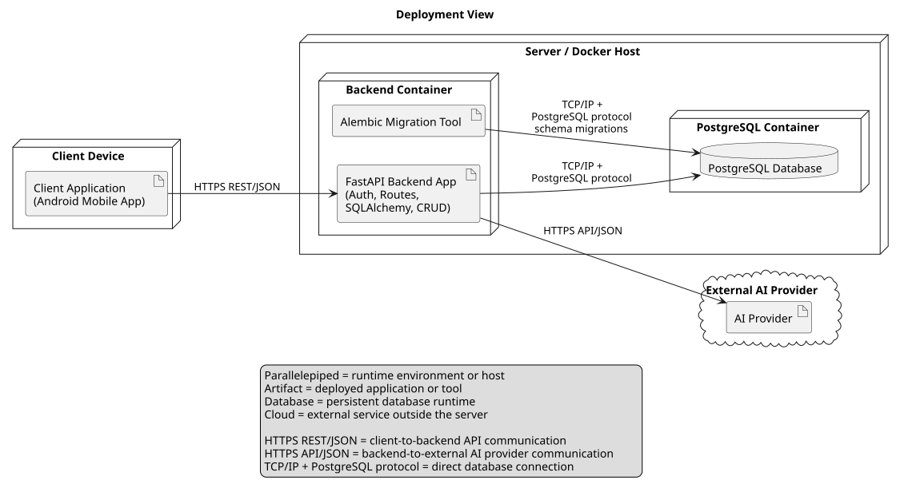

# Deployment View

This page describes the deployment architecture view of the LAMBA project.

The deployment view shows how the mobile client, backend service, database, migrations, and external AI provider are deployed and connected.

