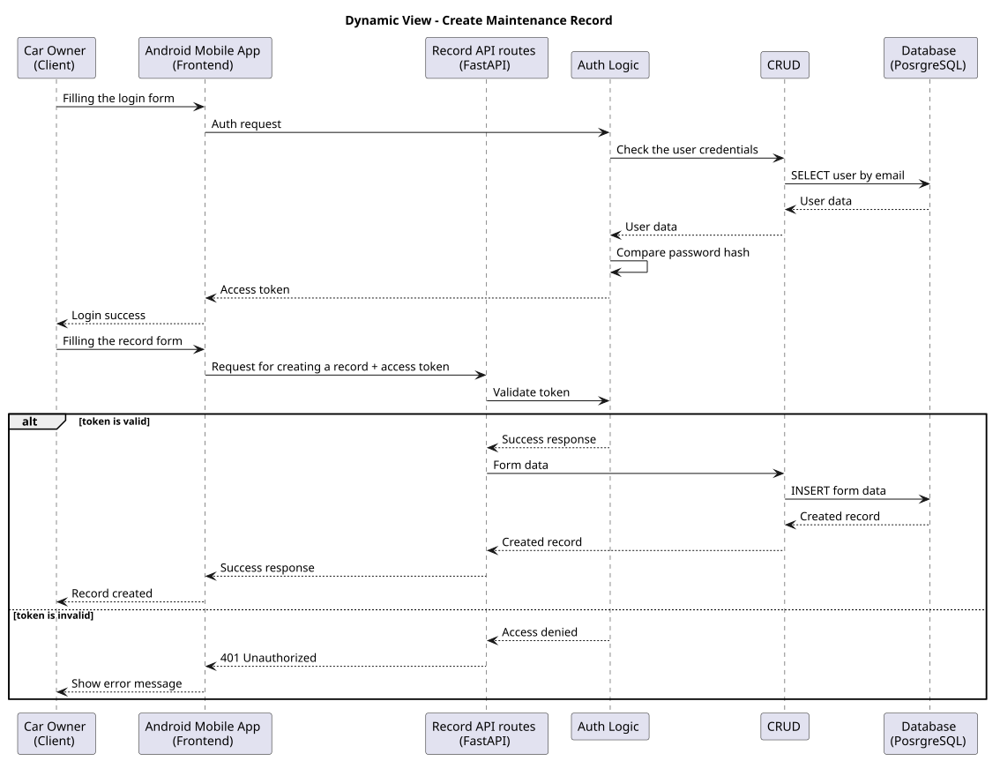

# Dynamic View

This page describes the dynamic architecture view of the LAMBA project.

The dynamic view shows a representative runtime scenario for creating a car-related record, including authentication, token validation, backend processing, database interaction, and response handling.

