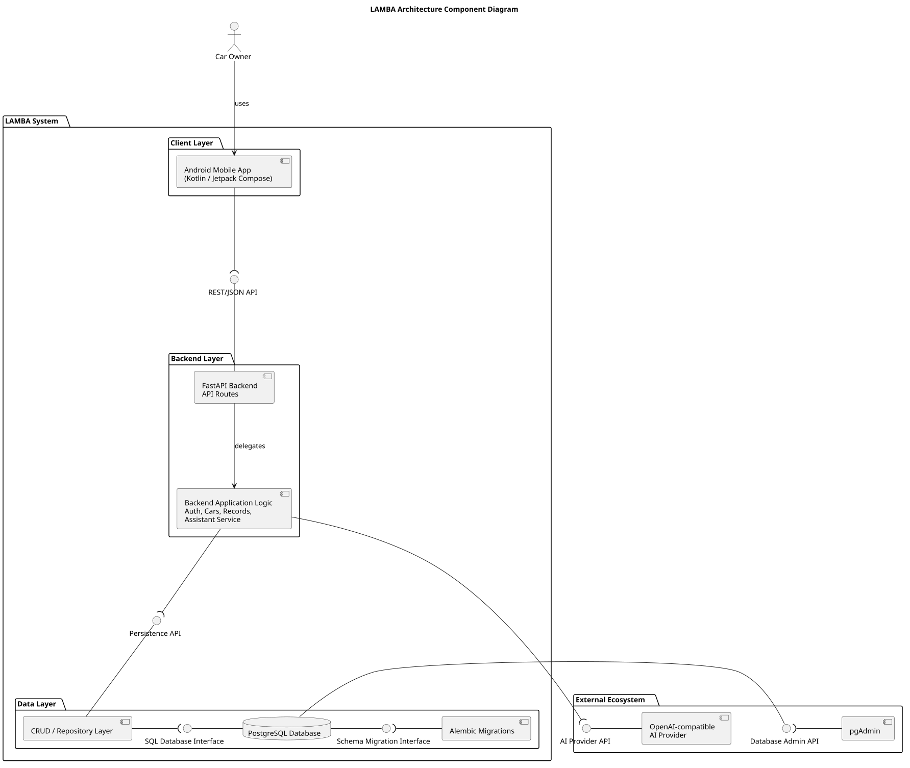

# Static View

This page describes the static architecture view of the LAMBA project.

The static view shows the main system components and their relationships: the Android client, backend API, database, migrations, and external AI provider.

