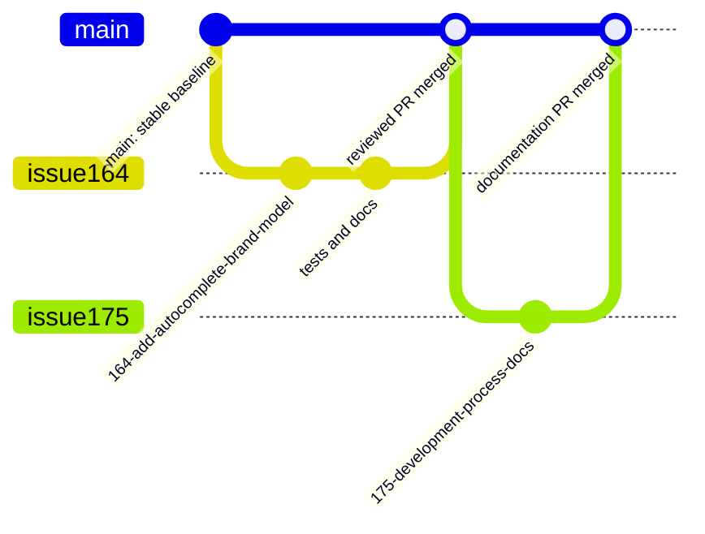

# Development Process and Configuration Management


## Actual Team Development Process

The team works in short Sprint cycles. Product work starts as GitHub Issues, usually as user stories or supporting Product Backlog Items. Course-only reporting work is tracked separately as course tasks when needed, but maintained product and process documentation under `docs/` is treated as repository work because it improves the project.

The usual flow is:

1. Capture a product need, customer request, quality concern, bug, or documentation need as an issue.
2. Refine the issue with enough context, acceptance criteria, estimate, Sprint assignment, implementer, and reviewer.
3. Select ready items for the active Sprint and connect them to the Sprint milestone or Sprint Backlog view.
4. Implement the change on a branch created from `main`.
5. Open a pull request that links the issue and explains acceptance-criteria verification and testing.
6. Have the pull request reviewed by a team member other than the implementer when Sprint tracking requires a reviewer.
7. Run the relevant automated checks, such as GitHub Actions backend tests, linting, dependency audit, coverage reporting, and Markdown link checking when applicable.
8. Update documentation or changelog entries when the change affects maintained artifacts, setup, testing, quality evidence, or user-visible behavior.
9. Merge the pull request into the protected default branch after review approval and passing relevant checks.
10. Mark the related issue or supporting PBI as `Done` only after the Definition of Done is satisfied.

## Product Backlog and Sprint Backlog Management

The Product Backlog is managed through GitHub Issues and GitHub Projects views. User stories are tracked with stable IDs in GitHub Issues and indexed in [docs/user-stories.md](user-stories.md). The Sprint-by-Sprint delivery plan is maintained in [docs/roadmap.md](roadmap.md).

The team uses:

- GitHub Issues for user stories, supporting PBIs, bugs, documentation work, and course tasks.
- GitHub issue templates for user stories, other PBIs, bug reports, and course tasks.
- GitHub Projects views for the Product Backlog and Sprint Backlog.
- Sprint milestones or equivalent Sprint containers to preserve Sprint Goal, dates, selected Sprint scope, and current execution state.
- Weekly reports under `reports/` as canonical public indexes for assignment evidence.

Product Backlog refinement happens throughout the Sprint. Near-term PBIs should be clear enough to estimate and select for Sprint work. If a user story is too large or unclear, the team splits it or creates linked supporting PBIs before treating it as ready for implementation.

The Product Backlog view is the single ordered source of future product work. The Sprint Backlog view is the inspection view for the active Sprint and should contain the issues assigned to the active Sprint milestone. Markdown files such as this one explain the process, but they do not replace the GitHub board, issue tracker, milestone, or PR history as execution evidence.

## Workflow States and Entry Criteria

The team uses the Work Status values required by the shared process rules. These statuses appear in issue templates and should be kept consistent in the issue tracker, project views, user-story index, and Sprint evidence.

| Work Status | Entry criteria | Exit criteria |
|---|---|---|
| `To Do` | The PBI is known and belongs in the Product Backlog, but is not yet ready for current Sprint execution. | The item is refined, estimated, selected for a Sprint, assigned, and has acceptance criteria. |
| `Ready` | The PBI is selected for the current Sprint, has a clear expected outcome, description, acceptance criteria, Story Points estimate, implementer, reviewer, and Sprint assignment. | Work starts on a branch or the team decides to remove it from Sprint scope. |
| `In Progress` | The implementer has started design, coding, testing, or documentation work for the PBI. | A pull request or reviewable artifact is ready for review. |
| `Review` | The issue-linked PR is open, acceptance criteria verification is described, and review or CI validation is in progress. | The PR is approved, checks pass, and the change is merged, or the item returns to `In Progress` for rework. |
| `Done` | The issue acceptance criteria and the team Definition of Done are satisfied. For implementation/supporting PBIs, the issue-linked PR is merged into the protected default branch. | No further workflow movement is expected unless follow-up work is discovered and tracked as a new issue. |

## Sprint Process

Sprints are the team's recurring planning and inspection container. Sprint runs from Monday to Sunday.

During Sprint Planning, the team defines:

- the Sprint Goal
- selected Sprint PBIs
- Story Point estimates
- implementer and reviewer responsibilities
- acceptance criteria and required evidence
- the Sprint milestone or Sprint Backlog view used to inspect progress

During the Sprint, the team coordinates progress through the Sprint Backlog and issue statuses. If customer feedback, technical blockers, or availability risks make the original scope less valuable, the team adjusts the Sprint plan and records the decision in the relevant issue, roadmap, report, or retrospective.

At Sprint Review, the team demonstrates the current increment to the customer or stakeholder, records feedback, and links follow-up requests to Product Backlog or Sprint Backlog items. At Sprint Retrospective, the team records what went well, what did not go well, and one or two concrete improvements for the next Sprint.

## Issue Workflow

User-story issues use the `User Story` template. Each user story should include:

- stable user-story ID;
- user-story statement;
- persona, desired action, and expected value;
- MoSCoW priority;
- requirement status;
- Work Status;
- MVP version;
- Story Points;
- implementer and reviewer where applicable;
- Sprint assignment where applicable;
- notes, constraints, assumptions, and open questions;
- acceptance criteria.

Supporting product work uses the `Other PBI` template. Supporting PBIs are used when implementation, design, testing, deployment, documentation, or other work needs its own responsibility, estimate, acceptance criteria, review, or verification evidence.

Bug reports use the bug template and should include reproduction steps, expected behavior, actual behavior, environment, and acceptance criteria. Course-only work may use the course-task template and is not treated as a PBI unless it also improves the maintained product repository.

## Git and Review Workflow

The team uses a branch-and-pull-request workflow with `main` as the protected default branch.

Before starting new work, developers update their local repository metadata with git fetch origin and check whether the local main and origin/main are synchronized. Work should branch from the current main after the developer has confirmed that it matches the protected remote baseline.

The repository history shows both older branches and newer issue-linked branches. 

### Branching

New work starts from the latest `main`. Branches should be created from the related issue page where practical. The current required pattern is:

```text
<issue-number>-short-description
```

Examples from the repository include `164-add-autocomplete-brand-model`, `170-document-architecture-and-adr`, and `172-integration-test-for-database`. A short-lived local branch may use an equivalent descriptive name while drafting, but the PR branch should keep the issue number visible so reviewers and graders can trace the work.

### Pull Requests

Pull requests should use the repository PR template. Each PR should include:

- a short description of the change
- the related issue, using `Closes #...` when the PR completes the issue
- the type of change
- acceptance criteria verification
- testing performed
- changelog decision
- reviewer checklist confirmation

The PR should be linked to the related issue or PBI so GitHub preserves traceability between issue, branch, commits, review, checks, and merge.

### Review and Merge

The reviewer must be different from the implementer when Sprint tracking requires a reviewer. Review checks whether the acceptance criteria are satisfied, the Definition of Done is met, tests or CI checks pass, documentation is updated where needed, and no secrets or private customer data were committed.

The team avoids direct commits to `main` for normal work. Changes are merged after review and successful required checks. After merge, the issue is moved to `Done` only when the PR is merged and all relevant evidence is preserved.

## Git Workflow Diagram



## Diagram Explanation

The diagram shows the team's normal repository workflow. `main` is the stable baseline and should match `origin/main` before new work starts. A developer creates a short-lived issue-linked branch for a feature, bug fix, test update, architecture update, or documentation change. The branch contains implementation commits and any required tests, changelog entries, or documentation updates. The change returns to `main` only through a reviewed pull request. Assignment reports and maintained documentation may also be updated through their own issue-linked documentation branches when the work is large enough to review separately.

## Traceability

The team preserves traceability between requirements, implementation, review, and verification evidence.

At minimum, traceability should connect:

- stable user-story IDs in [docs/user-stories.md](user-stories.md);
- user-story issues;
- linked supporting PBIs;
- Sprint assignment or milestone;
- branches and commits;
- pull requests;
- CI runs or test evidence;
- customer review, UAT, or weekly report evidence where applicable.

For user stories, the story is complete only when all supporting PBIs required to satisfy the story acceptance criteria are completed, reviewed, merged, verified, and marked `Done`. Supporting PBIs normally link directly to the PRs that implement or verify them. Weekly reports summarize and link evidence instead of duplicating the full issue history.

## Definition of Done

The team maintains its detailed Definition of Done in [docs/definition-of-done.md](definition-of-done.md). A PBI may be marked `Done` only when its own acceptance criteria are satisfied and the team Definition of Done is satisfied.

The detailed checklist lives in docs/definition-of-done.md. A Product Backlog Item may be marked Done only when its issue-specific acceptance criteria are satisfied and the team Definition of Done is satisfied.

The Definition of Done requires:

- all issue acceptance criteria are verified
- the work is linked to the related GitHub issue or PBI
- the work is reviewed and approved by another team member
- the issue-linked pull request is merged into the protected default branch
- relevant CI checks pass on the pull request and protected default branch
- relevant automated unit tests pass
- relevant automated integration tests pass
- relevant automated quality requirement tests pass for affected quality requirements
- critical modules affected by the change keep at least 30% automated line coverage or have a documented TA-approved exception
- the selected additional QA check passes when applicable
- testing evidence is preserved in the pull request, CI run, test report, or linked documentation
- registration and login changes handle valid input, invalid input, and clear user-facing error messages
- vehicle digital twin changes correctly save and display car data
- maintenance history, expense, and timeline changes keep records consistent between the UI, backend, and database where applicable
- AI chat changes return a useful response or fallback message and do not freeze or crash the application
- for user stories, all linked supporting PBIs required to satisfy the story are completed, reviewed, merged, verified, and marked Done
- docs/testing.md is updated when tests, coverage, CI checks, QA checks, or testing evidence change
- docs/quality-requirements.md is updated when quality requirements change
- docs/quality-requirement-tests.md is updated when automated QRTs change
- docs/user-acceptance-tests.md is updated when UAT scenarios, execution results, customer comments, or resulting PBIs change
- README.md is updated when setup, run, deployment, backend, Android, or access instructions change
- CHANGELOG.md is updated for user-visible changes, or the pull request marks the changelog update as not applicable
- public repository artifacts do not include credentials, private customer data, recordings, unnecessary PII, or confidential materials
- customer feedback or UAT findings that affect scope, quality, or usability are linked to a follow-up issue, PBI, roadmap item, or documented decision
- CI checks, automated tests, QRTs, coverage expectations, and the additional QA check remain active for later work or are replaced with documented equivalent or stronger checks

## Configuration and Secrets Management

Secrets must not be committed to the repository. Runtime secrets and local environment values are supplied through local `.env` files or CI secrets.

The repository commits sanitized example configuration instead of real credentials:

- [backend/.env.example](../backend/.env.example) documents backend environment variables and placeholder values.
- [backend/docker-compose.yml](../backend/docker-compose.yml) defines local database and pgAdmin services for development.
- [README.md](../README.md) and [backend/README.md](../backend/README.md) document setup and run instructions.

Ignored local and generated files include:

- `backend/.env` and `backend/.env.*`;
- backend virtual environments such as `backend/.venv/` and `backend/venv/`;
- Python caches, coverage output, logs, and local SQLite files;
- Android/Gradle local files such as `.gradle`, `local.properties`, selected `.idea` files, build outputs, captures, `.externalNativeBuild`, and `.cxx`.

The backend uses environment variables for database connection settings, JWT secret configuration, pgAdmin credentials, and AI provider configuration. The committed `.env.example` uses placeholders such as `<AI_API_KEY>` and development-only values such as `change_me`; real values must be replaced locally or through CI/deployment secrets.

## Reproducible Development Environment

The repository contains an Android frontend and a FastAPI backend.

For the Android app, developers use Android Studio, Android SDK 36, Gradle, and an Android emulator or supported physical device. The root [README.md](../README.md) documents how to clone the repository, open the project in Android Studio, sync Gradle, build the app, create an emulator, and run the project.

For the backend, developers use Python, FastAPI, Alembic, PostgreSQL, and Docker Compose. The backend setup path is documented in [backend/README.md](../backend/README.md):

```powershell
cd backend
python -m venv .venv
.\.venv\Scripts\Activate.ps1
pip install -r requirements.txt
docker compose up -d postgres pgadmin
alembic upgrade head
python -m uvicorn app.main:app --reload
```

The Android emulator reaches the host backend through `http://10.0.2.2:8000/`. Backend API documentation is available locally at `http://127.0.0.1:8000/docs` when the backend is running.

## CI and Deployment Process

The repository uses GitHub Actions for automated checks on pull requests and pushes to `main`.

The current CI checks include:

- backend Ruff linting for `backend/app` and `backend/tests`;
- backend dependency audit with `pip-audit`;
- backend tests with PostgreSQL service, Alembic migrations, FastAPI startup, `pytest`, and coverage reporting;
- Lychee link checking for Markdown files.

CI is part of the team's Definition of Done. Relevant checks should pass before merge. Markdown-heavy changes should pay special attention to the Lychee link checker because broken links affect maintained documentation and weekly report evidence.

The repository does not currently document automatic continuous deployment as the normal workflow. Product access is provided through runnable local setup instructions and assignment-specific release or hosted artifacts when required.

## Related Artifacts

- [Root README](https://github.com/ernest0507/LAMBA_Team-22/blob/main/README.md)
- [Backend setup and API documentation](https://github.com/ernest0507/LAMBA_Team-22/blob/main/backend/README.md)
- [Definition of Done](https://github.com/ernest0507/LAMBA_Team-22/blob/main/docs/definition-of-done.md)
- [User-story index](https://github.com/ernest0507/LAMBA_Team-22/blob/main/docs/user-stories.md)
- [Roadmap](https://github.com/ernest0507/LAMBA_Team-22/blob/main/docs/roadmap.md)
- [Testing documentation](https://github.com/ernest0507/LAMBA_Team-22/blob/main/docs/testing.md)
- [Quality requirements](https://github.com/ernest0507/LAMBA_Team-22/blob/main/docs/quality-requirements.md)
- [Quality requirement tests](https://github.com/ernest0507/LAMBA_Team-22/blob/main/docs/quality-requirement-tests.md)
- [User acceptance tests](https://github.com/ernest0507/LAMBA_Team-22/blob/main/docs/user-acceptance-tests.md)
- [Changelog](https://github.com/ernest0507/LAMBA_Team-22/blob/main/CHANGELOG.md)
- [Week 5 public report](https://github.com/ernest0507/LAMBA_Team-22/blob/main/reports/week5/README.md)
