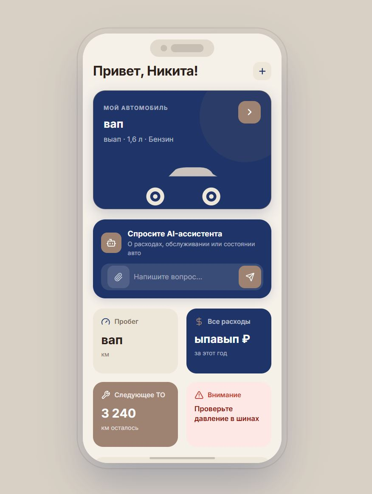
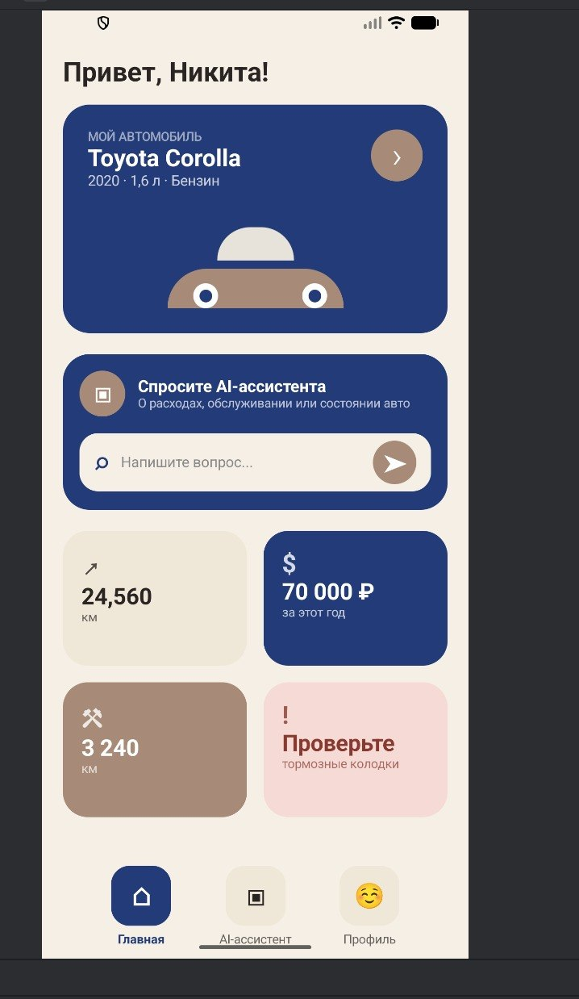
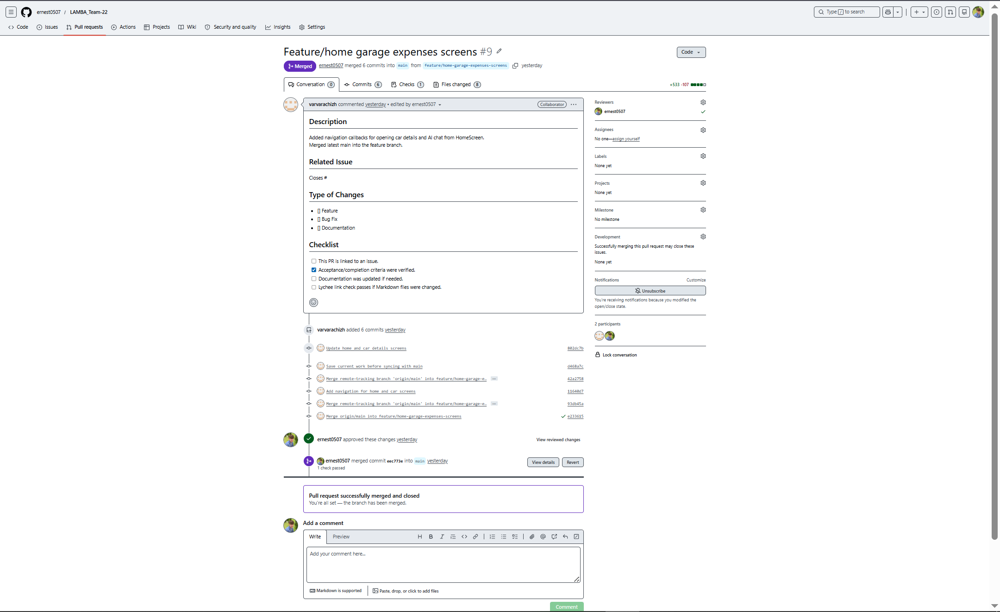
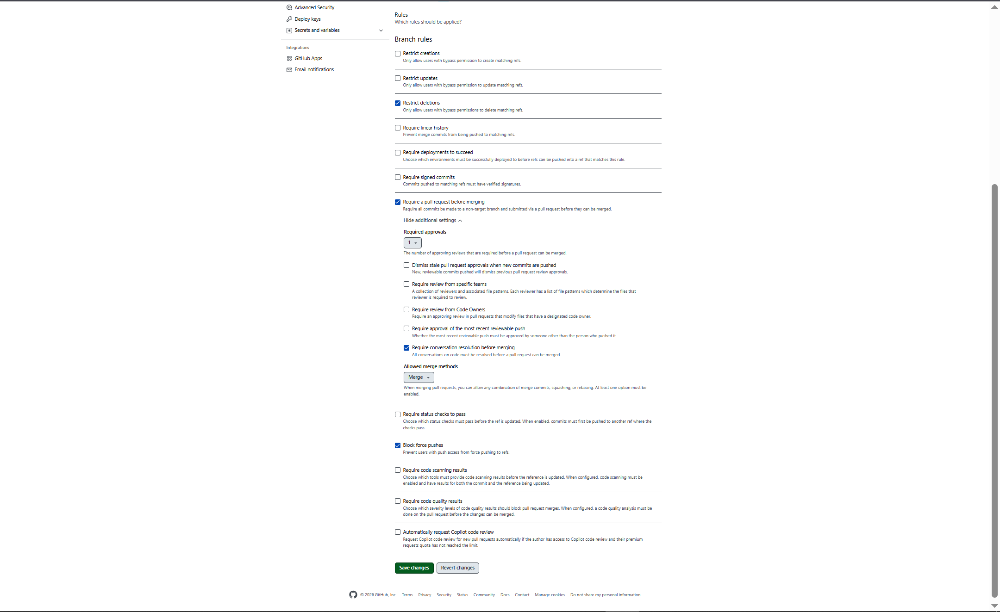

# Assignment 2 

## Project Overview

**LAMBA** is an Android application for creating a digital twin of a car. It allows users to keep vehicle information, view expenses and important events, and interact with a AI assistant.

The project is publicly developed under the MIT License.

- [MIT License](../../LICENSE)
- [Root README and local setup instructions](../../README.md)

## Required Documents

- [User Stories](./user-stories.md)
- [MVP v0 Report](./mvp-v0-report.md)
- [Customer Meeting Transcript](./customer-meeting-transcript.md)
- [Customer Meeting Summary](./customer-meeting-summary.md)
- [Week 2 Analysis](./analysis.md)
- [LLM Usage Report](./llm-report.md)

## User Stories and MVP v1 Scope

- [User Stories and Initial Proposed MVP v1 Scope](./user-stories.md)

## Prototype and Interface Artifacts

LAMBA uses a graphical mobile interface.

### Interactive Prototype

[Link](https://www.figma.com/make/jwbbppLUeySSzAk74nyGmF/Design-Prototype?fullscreen=1&t=l6y6G0iSyAAYo1O5-1&code-node-id=0-9)

### Prototype Screenshot

## MVP v0

LAMBA MVP v0 is an Android frontend application created with Kotlin and Jetpack Compose. It demonstrates the main navigation, digital car twin onboarding, expense timeline, expense statistics, and a simulated AI assistant.

- [MVP v0 Report](./mvp-v0-report.md)
- [Downloadable APK](https://drive.google.com/drive/folders/19qWz340HO7KuXygsQeKWR5n9QI-SV4m2?usp=sharing)
- [Local setup and run instructions](../../README.md)
- [Public MVP v0 Video Demonstration](https://drive.google.com/drive/folders/16ioINn3AaXiOIoyrjYcjZ_teW2S9cDDQ?usp=sharing)
- [Repeatable Smoke-Check Scenario](./mvp-v0-report.md#repeatable-smoke-check-scenario)

### MVP v0 Screenshot

## Pull Request Workflow

- [Pull Request Template](../../.github/pull_request_template.md)
- [PR #1 — Android Compose project setup](https://github.com/ernest0507/LAMBA_Team-22/pull/1)
- [PR #8 — Digital twin creation flow](https://github.com/ernest0507/LAMBA_Team-22/pull/8)
- [PR #10 — Final MVP v0 assembly](https://github.com/ernest0507/LAMBA_Team-22/pull/10)
- [PR #14 — Week 2 customer meeting documentation](https://github.com/ernest0507/LAMBA_Team-22/pull/14)
- [PR #16 — Home screen layout improvements](https://github.com/ernest0507/LAMBA_Team-22/pull/16)

### Reviewed Pull Request Screenshot

## Protected Default Branch

The default branch is `main`.

### Branch Protection Screenshot

## Lychee Link Checking

Lychee automatically checks Markdown links on pushes and pull requests targeting `main`.

- [Lychee GitHub Actions Workflow](../../.github/workflows/lychee.yml)
- [Latest Successful Lychee Run on Protected `main`](https://github.com/ernest0507/LAMBA_Team-22/actions/runs/27506126113)

## Coverage

### Prototype Coverage

The interactive prototype covers the main workflows associated with:

- `US-01` — entering information and creating a digital car twin;
- `US-02` — opening and interacting with the AI assistant;
- `US-03` — viewing the timeline of expenses and important events;
- `US-04` — viewing expense totals and statistics.

The prototype demonstrates the proposed MVP v1 experience and navigation between the main application screens.

### MVP v0 Coverage

The MVP v0 foundation represents:

- US-01 through a frontend-only digital twin creation flow;
- US-02 through a simulated AI assistant and mock responses;
- US-03 through a timeline containing placeholder expenses and events;
- US-04 through sample expense totals and statistics.

The current implementation uses placeholder data and does not include a backend, database, or external AI service.

Implementation limitations and the repeatable smoke-check scenario are documented in the:

- [MVP v0 Report](./mvp-v0-report.md)

## Customer Review

The team reviewed the user stories, MoSCoW priorities, initial proposed MVP v1 scope, and prototype direction with the customer.

- [Sanitized Customer Meeting Transcript](./customer-meeting-transcript.md)
- [Customer Meeting Summary](./customer-meeting-summary.md)

## Week 2 Analysis

The team’s learning points, validated assumptions, unresolved questions, technical risks, and planned response are documented in:

- [Week 2 Analysis](./analysis.md)

## LLM Usage

The use of ChatGPT, Figma AI tools, and other AI assistance during documentation, translation, prototyping, and frontend development is documented in:

- [LLM Usage Report](./llm-report.md)
