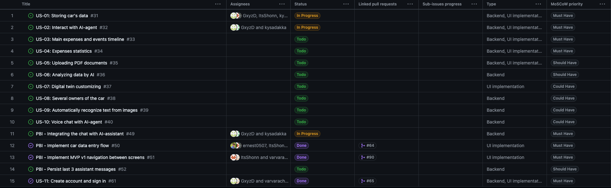
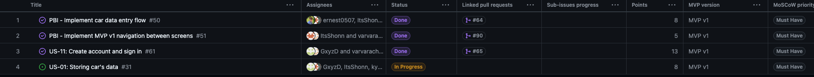
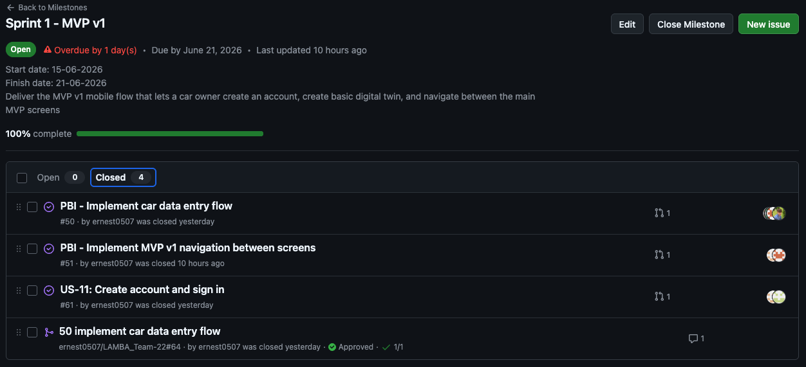
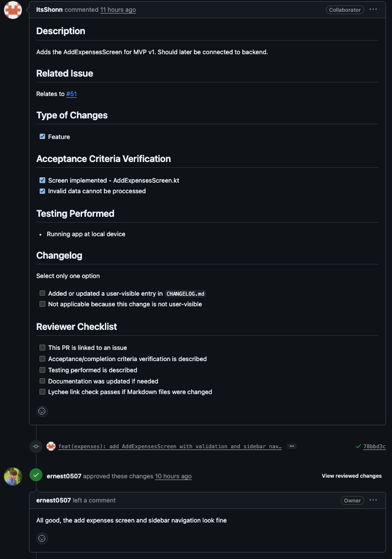

# Week 3 Report — Assignment 3

## Project Overview

**Project name:** LAMBA
**Repository:** [LAMBA_Team-22](https://github.com/ernest0507/LAMBA_Team-22)
**License:** [LICENSE](https://github.com/ernest0507/LAMBA_Team-22/blob/main/LICENSE)

LAMBA is a mobile application for car owners. The product helps users store car-related information, create a basic digital twin of their vehicle, and interact with an AI assistant for car-related support, recommendations, and future maintenance guidance.

This file is the canonical public Week 3 report and submission index for Assignment 3.

## Submission Index

Required Week 3 public report files:

* [Customer review transcript](./customer-review-transcript.md)
* [Customer review summary](./customer-review-summary.md)
* [Week 3 reflection](./reflection.md)
* [Sprint retrospective](./retrospective.md)
* [LLM usage report](./llm-report.md)

Maintained project documentation:

* [Current user stories](https://github.com/ernest0507/LAMBA_Team-22/blob/main/docs/user-stories.md)
* [Historical Week 2 user stories](https://github.com/ernest0507/LAMBA_Team-22/blob/main/reports/week2/user-stories.md)
* [Process Requirements](https://github.com/ernest0507/LAMBA_Team-22/blob/main/Process_Requirements.md)
* [Roadmap](https://github.com/ernest0507/LAMBA_Team-22/blob/main/docs/roadmap.md)
* [Definition of Done](https://github.com/ernest0507/LAMBA_Team-22/blob/main/docs/definition-of-done.md)
* [CHANGELOG.md](https://github.com/ernest0507/LAMBA_Team-22/blob/main/CHANGELOG.md)
* [Root README.md](https://github.com/ernest0507/LAMBA_Team-22/blob/main/README.md)

Workflow templates:

* [Issue templates](https://github.com/ernest0507/LAMBA_Team-22/tree/main/.github/ISSUE_TEMPLATE)
* [Extended PR/MR template](https://github.com/ernest0507/LAMBA_Team-22/blob/main/.github/pull_request_template.md)

## User Story and PBI Scope Since Assignment 2

Since Assignment 2, the team has moved from the initial user-story set toward a more structured Product Backlog. The current scope focuses on MVP v1 delivery and backlog refinement.

The main current product direction includes:

* storing car-related data;
* creating a basic digital twin for a vehicle;
* integrating or preparing integration with an AI assistant chat;
* implementing navigation between the main MVP screens;
* improving the frontend design and visual consistency;
* connecting the product foundation to backend functionality.

The historical Assignment 2 scope is preserved here:

* [Historical Week 2 user stories](https://github.com/ernest0507/LAMBA_Team-22/blob/main/reports/week2/user-stories.md)

The current user-story and PBI scope is maintained here:

* [Current user stories](https://github.com/ernest0507/LAMBA_Team-22/blob/main/docs/user-stories.md)
* [Product Backlog board/view](https://github.com/users/ernest0507/projects/2)
* [Current Sprint Backlog board/view](https://github.com/users/ernest0507/projects/3)
* [Current Sprint milestone](https://github.com/ernest0507/LAMBA_Team-22/milestone/1)

## Customer Feedback from Assignment 2 Addressed in MVP v1

The team addressed the following feedback points from Assignment 2 during MVP v1 work:

* The product moved from the earlier MVP v0/prototype direction toward a more integrated MVP v1.
* Backend connection work was added to the product foundation.
* The application design was updated to improve visual clarity and consistency.
* The team continued developing the car digital twin direction.
* The team identified that user registration and car registration should be represented more explicitly as a separate flow.
* The team clarified that AI-based prediction should start with a simpler and more reliable data-supported approach before presenting it as a dependable prediction feature.

Some feedback remains in progress and will continue into the next Sprint, especially AI assistant integration, registration/onboarding, release preparation, and stronger frontend-backend synchronization.

## Backlog, Sprint, and MVP v1 Tracking

**Product Backlog board/view:** [GitHub Project — Product Backlog](https://github.com/users/ernest0507/projects/2)
**Current Sprint Backlog board/view:** [GitHub Project — Sprint Backlog](https://github.com/users/ernest0507/projects/3)
**Current Sprint milestone:** [Sprint 1 - MVP v1](https://github.com/ernest0507/LAMBA_Team-22/milestone/1)
**MVP v1 scope view / version field / filtered view:** [Current Sprint Backlog board/view — MVP v1 scope](https://github.com/users/ernest0507/projects/3)

**Total Product Backlog size:** 208 Story Points
**Total current Sprint Backlog size:** 34 Story Points
**Total visible MVP v1 scope size:** 74 Story Points

Story Point totals are based on the current GitHub Projects `Points` field shown in the Product Backlog and Sprint Backlog views. They should be rechecked before final submission if the backlog changes.

| Scope                       |                                                    Included issues / PBIs | Total Points |
| --------------------------- | ------------------------------------------------------------------------: | -----------: |
| Product Backlog             | #31, #32, #33, #34, #35, #36, #37, #38, #39, #40, #49, #50, #51, #52, #61 |          208 |
| Current Sprint Backlog view |                                                        #50, #51, #61, #31 |           34 |
| Visible MVP v1 scope        |                                              #31, #32, #49, #50, #51, #61 |           74 |

The current Sprint milestone is used as the authoritative source for the Sprint Goal, Sprint dates, and current Sprint scope.

## Selected MVP v1 Scope

The selected MVP v1 scope currently includes:

* car data storage and basic digital twin foundation;
* AI assistant chat integration work;
* navigation between the main MVP screens;
* updated interface design and improved frontend structure;
* backend-connected product foundation;
* account creation and sign-in support;
* digital twin creation through backend API integration.

Current linked MVP v1 / Sprint items visible in the backlog views:

* [US-01: Storing car's data](https://github.com/ernest0507/LAMBA_Team-22/issues/31) — 8 Story Points; related evidence: [PR #104](https://github.com/ernest0507/LAMBA_Team-22/pull/104), [PR #98](https://github.com/ernest0507/LAMBA_Team-22/pull/98)
* [US-02: Interact with AI-agent](https://github.com/ernest0507/LAMBA_Team-22/issues/32) — 20 Story Points
* [PBI - Integrating the chat with AI-assistant](https://github.com/ernest0507/LAMBA_Team-22/issues/49) — 20 Story Points; related evidence: [PR #84](https://github.com/ernest0507/LAMBA_Team-22/pull/84)
* [PBI - Implement car data entry flow](https://github.com/ernest0507/LAMBA_Team-22/issues/50) — 8 Story Points; linked PRs: [#64](https://github.com/ernest0507/LAMBA_Team-22/pull/64), [#100](https://github.com/ernest0507/LAMBA_Team-22/pull/100), [#106](https://github.com/ernest0507/LAMBA_Team-22/pull/106)
* [PBI - Implement MVP v1 navigation between screens](https://github.com/ernest0507/LAMBA_Team-22/issues/51) — 5 Story Points; linked PR: [#90](https://github.com/ernest0507/LAMBA_Team-22/pull/90)
* [US-11: create account and sign in](https://github.com/ernest0507/LAMBA_Team-22/issues/61) — 13 Story Points; linked PR: [#65](https://github.com/ernest0507/LAMBA_Team-22/pull/65)

The MVP v1 scope is still being finalized. This section should be updated before final submission if additional PBIs are added to the MVP v1 scope.

## Process and Workflow

The team follows the shared process definitions from [Process_Requirements.md](https://github.com/ernest0507/LAMBA_Team-22/blob/main/Process_Requirements.md) for PBI types, statuses, priorities, Sprint milestone usage, MVP version tracking, and task decomposition.

The team uses GitHub issues and GitHub Projects to track product work and course tasks. Product Backlog Items represent product work such as user stories, technical work, testing, deployment, design, and maintained documentation. Course reporting files under `reports/` are treated as Course Task artifacts unless they directly maintain the product repository.

The team uses:

* GitHub issues for PBIs, user stories, supporting tasks, and course tasks;
* GitHub Projects for Product Backlog and Sprint Backlog views;
* Sprint milestone for Sprint Goal, Sprint dates, and Sprint-selected scope;
* linked PRs/MRs as implementation and review evidence;
* `docs/user-stories.md` as the current user-story index;
* `docs/roadmap.md` as the lightweight Sprint-by-Sprint delivery plan;
* `docs/definition-of-done.md` as the shared completion standard.

## Roadmap Direction

The current roadmap is maintained separately:

* [Roadmap](https://github.com/ernest0507/LAMBA_Team-22/blob/main/docs/roadmap.md)

For Week 3, the roadmap focuses on MVP v1 delivery. The next roadmap update will be added after the next Sprint milestone, dates, Sprint Goal, and planned PBIs are confirmed.

## Verification Evidence for Completed MVP v1 PBIs

Verification evidence is tracked through linked GitHub issues, linked PRs/MRs, backlog screenshots, Sprint Backlog screenshots, the MVP v1 release, the delivered APK artifact, and demo/screenshot evidence.

| PBI / User Story                                                                                           | Verification Evidence                                                                                                                                                                                                                                                                                                                                                                                                                                                                                    |
| ---------------------------------------------------------------------------------------------------------- | -------------------------------------------------------------------------------------------------------------------------------------------------------------------------------------------------------------------------------------------------------------------------------------------------------------------------------------------------------------------------------------------------------------------------------------------------------------------------------------------------------- |
| [US-01: Storing car's data](https://github.com/ernest0507/LAMBA_Team-22/issues/31)                         | Covered by linked implementation evidence: [PR #104 — Add maintenance records backend](https://github.com/ernest0507/LAMBA_Team-22/pull/104), [PR #98 — Integrate frontend auth API](https://github.com/ernest0507/LAMBA_Team-22/pull/98), and Sprint/Product Backlog screenshots showing the item in MVP v1 scope. Additional visual evidence is available in the [screenshots and demo folder](https://drive.google.com/drive/folders/1lQGXUi2aoIEYZExKisiZZZzpuK6-9fsq?usp=drive_link).               |
| [PBI - Integrating the chat with AI-assistant](https://github.com/ernest0507/LAMBA_Team-22/issues/49)      | Covered by linked implementation evidence and team traceability: [PR #84](https://github.com/ernest0507/LAMBA_Team-22/pull/84), with [#49](https://github.com/ernest0507/LAMBA_Team-22/issues/49) assigned to backend AI/auth integration work in the Sprint evidence. Additional demo/screenshot evidence is available in the [screenshots and demo folder](https://drive.google.com/drive/folders/1lQGXUi2aoIEYZExKisiZZZzpuK6-9fsq?usp=drive_link).                                                   |
| [PBI - Implement car data entry flow](https://github.com/ernest0507/LAMBA_Team-22/issues/50)               | Covered by linked implementation evidence: [PR #64](https://github.com/ernest0507/LAMBA_Team-22/pull/64), [PR #100 — Add car digital twin backend](https://github.com/ernest0507/LAMBA_Team-22/pull/100), and [PR #106 — Integrate digital twin creation with backend API](https://github.com/ernest0507/LAMBA_Team-22/pull/106). Additional visual evidence is available in the [screenshots and demo folder](https://drive.google.com/drive/folders/1lQGXUi2aoIEYZExKisiZZZzpuK6-9fsq?usp=drive_link). |
| [PBI - Implement MVP v1 navigation between screens](https://github.com/ernest0507/LAMBA_Team-22/issues/51) | Covered by linked implementation evidence: [PR #90](https://github.com/ernest0507/LAMBA_Team-22/pull/90), plus Sprint Backlog screenshot evidence and the [screenshots and demo folder](https://drive.google.com/drive/folders/1lQGXUi2aoIEYZExKisiZZZzpuK6-9fsq?usp=drive_link).                                                                                                                                                                                                                        |
| [US-11: create account and sign in](https://github.com/ernest0507/LAMBA_Team-22/issues/61)                 | Covered by linked implementation evidence: [PR #65](https://github.com/ernest0507/LAMBA_Team-22/pull/65), plus Sprint Backlog screenshot evidence and the [screenshots and demo folder](https://drive.google.com/drive/folders/1lQGXUi2aoIEYZExKisiZZZzpuK6-9fsq?usp=drive_link).                                                                                                                                                                                                                        |

## Current Product Status

MVP v1 is currently delivered as release `v0.1.0` with an APK artifact available through Google Drive.

The team has prepared the Week 3 reporting structure, updated the roadmap, added customer review materials, collected screenshots for backlog/milestone/review evidence, and connected implementation evidence through issue-linked PRs.

Current status:

* backend connection work has been started and partially integrated;
* frontend design has been updated;
* car data entry flow has linked PR evidence;
* car digital twin backend has linked PR evidence;
* digital twin creation API integration has linked PR evidence;
* maintenance records backend has linked PR evidence;
* frontend authentication API integration has linked PR evidence;
* account creation and sign-in work has linked PR evidence;
* MVP v1 navigation work has linked PR evidence;
* AI assistant integration has linked PR evidence and is represented in the demo/screenshot evidence;
* customer feedback has been reviewed and reflected in Week 3 documentation;
* screenshots for backlog, sprint tracking, milestone, and reviewed PR evidence have been added;
* MVP v1 release, APK artifact, screenshots, and demo evidence are linked below.

## MVP v1 Access Instructions

To access the delivered MVP v1:

1. Open the [MVP v1 APK artifact](https://drive.google.com/file/d/1_lk8Nofg5oTMzxzNN2rY5IBNIW9RCrEG/view?usp=drive_link).
2. Download the APK file.
3. Open/install the APK on an Android device or Android emulator.
4. Run the application and follow the MVP v1 flow shown in the demo materials.
5. If Android blocks installation from unknown sources, allow APK installation for the selected file manager/browser and open the APK again.

No special test credentials are currently required in this report. If limited-permission test credentials are introduced before final submission, they should be added here.

## Next Steps

The team will:

* verify that all release, APK, screenshot, and demo links remain accessible until grading is complete;
* recheck Story Point totals before final submission if the backlog changes;
* verify GitHub Actions link checker after the final README update;
* update Moodle PDF commit-hash permalinks after the Week 3 PR is merged into the protected default branch;
* keep release, artifact, and demo access view-only and not publicly editable.

## Contribution Traceability

This table summarizes Week 3 issue, PR/MR, and review activity collected from repository evidence.

| Team member   | Issues / tasks                    | PRs / MRs                                        | Review activity                                                                   |
| ------------- | --------------------------------- | ------------------------------------------------ | --------------------------------------------------------------------------------- |
| @ernest0507   | #43, #46, #50, #62, #66, #69, #51 | #44, #47, #57, #63, #64, #68, #70, #90           | Reviewed and approved #41, #45, #58                                               |
| @varvarachizh | #26, #42, #48, #60, #69           | #41, #45, #58, #65, #70                          | Reviewed and approved #44, #47, #63, #68                                          |
| @vovger       | #77, #81                          | #75, #78, #86                                    | Participated through Week 3 documentation PRs and merged/report workflow evidence |
| @ItsShonn     | #80                               | #84, #87                                         | Reviewed and approved #57                                                         |
| @GxyzD        | #49, #80                          | #84                                              | Reviewed and approved #64                                                         |
| @kysadakka    | #49, #80                          | Linked as implementer on Sprint PBIs #49 and #80 | Reviewed and approved #65                                                         |

## Release and Documentation Links

* **SemVer release mapped to MVP v1:** [GitHub Release v0.1.0](https://github.com/ernest0507/LAMBA_Team-22/releases/tag/v0.1.0)
* **Delivered MVP v1 deployment / runnable artifact:** [MVP v1 APK artifact](https://drive.google.com/file/d/1_lk8Nofg5oTMzxzNN2rY5IBNIW9RCrEG/view?usp=drive_link)
* **Public sanitized video demonstration under two minutes:** [Screenshots and demo folder](https://drive.google.com/drive/folders/1lQGXUi2aoIEYZExKisiZZZzpuK6-9fsq?usp=drive_link)
* **Screenshots and demo evidence folder:** [Google Drive folder](https://drive.google.com/drive/folders/1lQGXUi2aoIEYZExKisiZZZzpuK6-9fsq?usp=drive_link)
* [CHANGELOG.md](https://github.com/ernest0507/LAMBA_Team-22/blob/main/CHANGELOG.md)
* [Process_Requirements.md](https://github.com/ernest0507/LAMBA_Team-22/blob/main/Process_Requirements.md)
* [Roadmap](https://github.com/ernest0507/LAMBA_Team-22/blob/main/docs/roadmap.md)
* [Definition of Done](https://github.com/ernest0507/LAMBA_Team-22/blob/main/docs/definition-of-done.md)
* [Issue templates](https://github.com/ernest0507/LAMBA_Team-22/tree/main/.github/ISSUE_TEMPLATE)
* [Extended PR/MR template](https://github.com/ernest0507/LAMBA_Team-22/blob/main/.github/pull_request_template.md)
* **Reviewed issue-linked PRs/MRs created during Week 3:**

  * [PR #64](https://github.com/ernest0507/LAMBA_Team-22/pull/64) — linked to [PBI #50](https://github.com/ernest0507/LAMBA_Team-22/issues/50), car data entry flow.
  * [PR #90](https://github.com/ernest0507/LAMBA_Team-22/pull/90) — linked to [PBI #51](https://github.com/ernest0507/LAMBA_Team-22/issues/51), MVP v1 navigation between screens.
  * [PR #65](https://github.com/ernest0507/LAMBA_Team-22/pull/65) — linked to [US-11 #61](https://github.com/ernest0507/LAMBA_Team-22/issues/61), account creation and sign-in.
  * [PR #84](https://github.com/ernest0507/LAMBA_Team-22/pull/84) — backend AI/auth integration work related to [PBI #49](https://github.com/ernest0507/LAMBA_Team-22/issues/49) / [#80](https://github.com/ernest0507/LAMBA_Team-22/issues/80).
  * [PR #98](https://github.com/ernest0507/LAMBA_Team-22/pull/98) — frontend auth API integration, supporting authenticated MVP v1 flows.
  * [PR #100](https://github.com/ernest0507/LAMBA_Team-22/pull/100) — car digital twin backend, related to car data storage and digital twin creation.
  * [PR #104](https://github.com/ernest0507/LAMBA_Team-22/pull/104) — maintenance records backend, related to [US-01 #31](https://github.com/ernest0507/LAMBA_Team-22/issues/31).
  * [PR #106](https://github.com/ernest0507/LAMBA_Team-22/pull/106) — digital twin creation integration with backend API, related to [PBI #50](https://github.com/ernest0507/LAMBA_Team-22/issues/50).
* [Access or run instructions in root README.md](https://github.com/ernest0507/LAMBA_Team-22/blob/main/README.md)

## Screenshots

Screenshots should be placed in `reports/week3/images/`.

The following screenshots have already been added to the repository. Additional MVP v1 screenshots and the demo video are available in the shared evidence folder:

* [Screenshots and demo folder](https://drive.google.com/drive/folders/1lQGXUi2aoIEYZExKisiZZZzpuK6-9fsq?usp=drive_link)

### Product Backlog view

### Sprint Backlog view

### Sprint milestone

### MVP version field, grouped view, or filtered view

The current Sprint Backlog board is used as the MVP v1 scope view for Week 3. It shows the selected Sprint/MVP v1 work and the Story Points field.

* [Current Sprint Backlog board/view — MVP v1 scope](https://github.com/users/ernest0507/projects/3)

### SemVer release

The MVP v1 SemVer release is published as:

* [GitHub Release v0.1.0](https://github.com/ernest0507/LAMBA_Team-22/releases/tag/v0.1.0)

Additional release screenshots, if needed, are available in the shared evidence folder:

* [Screenshots and demo folder](https://drive.google.com/drive/folders/1lQGXUi2aoIEYZExKisiZZZzpuK6-9fsq?usp=drive_link)

### Delivered MVP v1

The delivered MVP v1 APK artifact is available here:

* [MVP v1 APK artifact](https://drive.google.com/file/d/1_lk8Nofg5oTMzxzNN2rY5IBNIW9RCrEG/view?usp=drive_link)

Additional delivered MVP v1 screenshots and demo evidence are available here:

* [Screenshots and demo folder](https://drive.google.com/drive/folders/1lQGXUi2aoIEYZExKisiZZZzpuK6-9fsq?usp=drive_link)

### Example reviewed issue-linked PR/MR

## Customer Review Evidence

The customer review evidence is maintained in:

* [Customer review transcript](./customer-review-transcript.md)
* [Customer review summary](./customer-review-summary.md)

If public transcript publication is refused but private sharing is permitted, the transcript should be shared only through Moodle or an equivalent private instructor-sharing channel and this section should be updated accordingly.

If recording or private sharing is refused, the team should provide:

* [Customer review notes](./customer-review-notes.md)

## Week 3 Reflection, Retrospective, and LLM Report

* [Week 3 reflection](./reflection.md)
* [Sprint retrospective](./retrospective.md)
* [LLM usage report](./llm-report.md)
