# Week 4 Report — LAMBA Team 22

## 1. Project Links

- **Repository:** https://github.com/ernest0507/LAMBA_Team-22
- **Product Backlog:** https://github.com/users/ernest0507/projects/2
- **Week 4 Sprint Backlog:** https://github.com/users/ernest0507/projects/6/views/1
- **Week 4 Milestone:** https://github.com/ernest0507/LAMBA_Team-22/milestone/2
- **Roadmap:** [docs/roadmap.md](../../docs/roadmap.md)
- **Release:** https://github.com/ernest0507/LAMBA_Team-22/releases/tag/v0.2.0
- **APK / runnable artifact:** https://drive.google.com/file/d/1zNM3IDQtXRBPBlhSVomeI7zgFqK208OB/view?usp=drive_link
- **Demo video / product presentation:** https://drive.google.com/file/d/1g25mtRweze9G2YHoBLL0hCbxXLWGCi98/view?usp=sharing
- **Sprint Review / UAT recording:** https://drive.google.com/file/d/1YpngS592lhOvcq16VD1R_gis7HQDLcfY/view?usp=drive_link
- **Latest successful backend tests run:** https://github.com/ernest0507/LAMBA_Team-22/actions/runs/28329787263

## 2. Sprint Overview

- **Sprint dates:** 22.06–28.06
- **Sprint Review / UAT date:** 26.06.2026
- **Main Sprint Goal:** add and demonstrate the AI-agent chat as the main product improvement.
- **Additional Sprint work:** expenses and events timeline, maintenance and repair forms, AI-agent interaction, AI chat integration, note type selection screen, expense form, and AI chat UI improvements.
- **Visible Sprint size:** 39 Story Points.
- **Release tag:** `v0.2.0` — Assignment 4 Sprint Increment.

## 3. Sprint Scope

| Item | Title | Story Points | Evidence |
|---|---|---:|---|
| #33 | US-03: Main expenses and events timeline | 13 | PRs #119, #124 |
| #116 | PBI — Implement maintenance and repair forms | 3 | PR #119 |
| #32 | US-02: Interact with AI-agent | 8 | PRs #137, #139 |
| #49 | PBI — Integrating the chat with AI-assistant | 5 | PR #137 |
| #118 | PBI — Implement note type selection screen and expenses form | 5 | PR #124 |
| #138 | PBI — Implemented the UI design for the AI chat on the home screen | 5 | PR #139 |

## 4. Delivered Increment

During Week 4, the team focused on turning the MVP into a more connected product increment. The delivered or demonstrated increment included:

- user registration and login flows;
- car digital twin creation and display;
- AI-agent chat interaction;
- expense recording through the AI chat;
- expense/history timeline;
- note type selection and manual expense form screens;
- maintenance and repair record screens;
- AI chat UI on the home screen;
- backend work for AI assistant message handling, extraction, validation, and tests;
- testing and quality documentation for Assignment 4.

## 5. Release, Artifact, and Changelog

- **Release:** https://github.com/ernest0507/LAMBA_Team-22/releases/tag/v0.2.0
- **APK / runnable artifact:** https://drive.google.com/file/d/1zNM3IDQtXRBPBlhSVomeI7zgFqK208OB/view?usp=drive_link
- **Demo video / product presentation:** https://drive.google.com/file/d/1g25mtRweze9G2YHoBLL0hCbxXLWGCi98/view?usp=sharing
- **CHANGELOG:** [CHANGELOG.md](../../CHANGELOG.md)

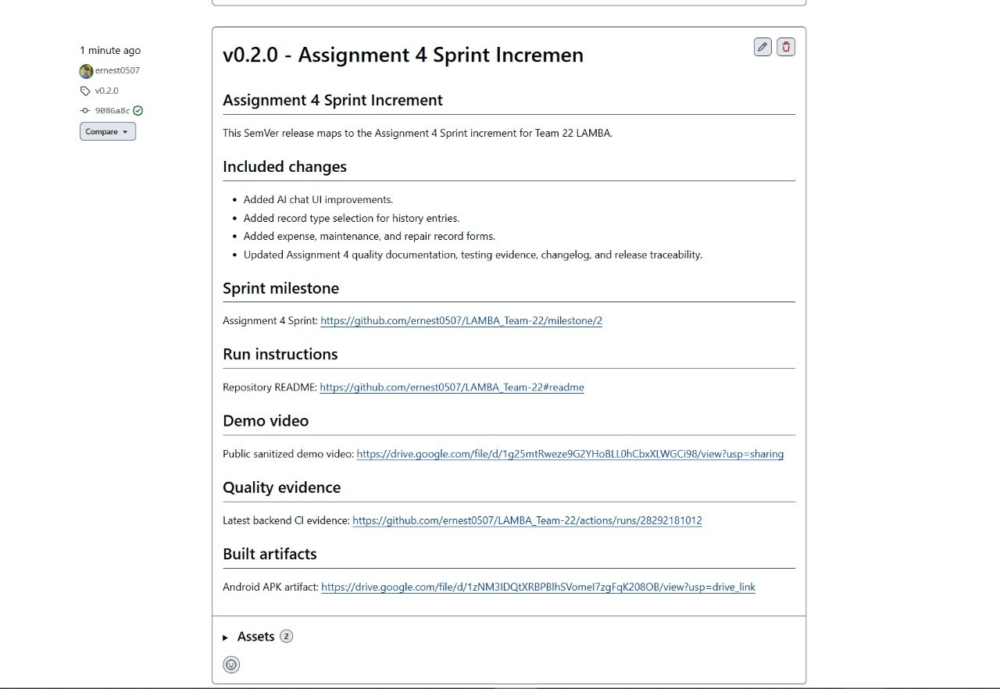

## 6. User Acceptance Testing

The customer executed four UAT scenarios during the Sprint Review / UAT session.

- **UAT document:** [docs/user-acceptance-tests.md](../../docs/user-acceptance-tests.md)
- **Sprint Review / UAT recording:** https://drive.google.com/file/d/1YpngS592lhOvcq16VD1R_gis7HQDLcfY/view?usp=drive_link
- **Customer review summary:** [customer-review-summary.md](customer-review-summary.md)
- **Customer review transcript:** [customer-review-transcript.md](customer-review-transcript.md)

| UAT scenario | Result | Customer notes |
|---|---|---|
| User registration | Accepted with comments | The flow is understandable, but clearer loading/success feedback is needed. |
| Car digital twin creation | Accepted with comments | The flow works, but body type and brand/model input should be improved. |
| AI chat / expense recording | Accepted with comments | The feature records expenses, but confirmation and history details should be clearer. |
| User login | Accepted | Login was accepted; sign-out/logout was requested for a future Sprint. |

## 7. Customer Feedback Response

The customer accepted the demonstrated UAT scenarios, but requested additional usability polish and follow-up improvements. The team linked the feedback to existing backlog items where possible and moved several polish-focused changes to the next Sprint.

| Customer feedback / follow-up area | Related backlog item | Status / response |
|---|---|---|
| Support account creation and sign-in flow. | US-11: Create account and sign in #61 | Done. The main account flow was accepted during UAT. |
| Verify registration behavior with automated testing. | PBI: automated Test - check registration response time #132 | Done. Test work was added for registration behavior. |
| Improve car data storage and digital twin foundation. | US-01: Storing car's data #31; PBI: Implement car data entry flow #50 | Done. The main car data flow and foundation are available. |
| Support digital twin customization. | US-07: Digital twin customizing #37 | Done. Further input polish is deferred to the next Sprint. |
| Add AI-agent interaction. | US-02: Interact with AI-agent #32; PBI: Integrating the chat with AI-assistant #49 | Implemented as the main Sprint Goal and included in the release increment. |
| Support AI assistant record extraction and record creation. | PBIs #121 and #123 | Done. Backend extraction and endpoint work were added. |
| Add AI assistant backend validation. | PBIs #134 and #136 | Done. Validation-related test work was added. |
| Improve AI chat UI. | PBI: Implemented the UI design for the AI chat on the home screen #138 | Done. The AI chat UI was included in the Week 4 increment. |
| Support expenses and events timeline. | US-03: Main expenses and events timeline #33 | Included in the Week 4 release scope. |
| Add manual expense form and note type selection. | PBI: Implement note type selection screen and expenses form #118 | Done. Screens were added for manual record creation. |
| Add maintenance and repair forms. | PBI: Implement maintenance and repair forms #116 | Done. Maintenance and repair screens were added. |
| Add chat history foundation. | PBI: Persist last 3 assistant messages #52 | Todo / follow-up. Planned as a next step for assistant message persistence. |
| Add sign-out/logout flow. | Next Sprint follow-up | Deferred to the next Sprint. |
| Add clearer registration loading/success UI feedback. | Next Sprint follow-up | Deferred to the next Sprint as usability polish. |
| Improve body type and brand/model selection specifically. | Next Sprint follow-up | Deferred to the next Sprint as car creation UX polish. |
| Improve the car placeholder/image. | Next Sprint follow-up | Deferred to the next Sprint as visual polish. |
| Refine AI assistant tone/personality as the user's car assistant. | Next Sprint follow-up | Deferred to the next Sprint as product behavior polish. |
| Keep achievements for later. | Future Sprint decision | Deferred. Achievements are not part of the current release focus. |

## 8. Quality, Testing, and CI Evidence

Related documentation and test evidence:

- **Definition of Done:** [docs/definition-of-done.md](../../docs/definition-of-done.md)
- **Quality Requirements:** [docs/quality-requirements.md](../../docs/quality-requirements.md)
- **Quality Requirement Tests:** [docs/quality-requirement-tests.md](../../docs/quality-requirement-tests.md)
- **Testing Documentation:** [docs/testing.md](../../docs/testing.md)
- **Backend Test Suite:** [backend/tests](../../backend/tests)
- **Backend Tests Workflow:** [.github/workflows/backend-tests.yml](../../.github/workflows/backend-tests.yml)
- **Latest successful backend tests run:** https://github.com/ernest0507/LAMBA_Team-22/actions/runs/28329787263

The project includes documented quality requirements, quality requirement tests, testing documentation, backend automated tests, and a GitHub Actions workflow for backend checks. The latest backend tests workflow run on `main` passed successfully.

Current testing status:

| Area | Evidence / link | Status |
|---|---|---|
| Quality requirements | [docs/quality-requirements.md](../../docs/quality-requirements.md) | Documented |
| Quality requirement tests | [docs/quality-requirement-tests.md](../../docs/quality-requirement-tests.md) | Documented |
| Testing strategy and coverage evidence | [docs/testing.md](../../docs/testing.md) | Documented |
| Backend automated tests | [backend/tests](../../backend/tests) | Added |
| CI workflow | [.github/workflows/backend-tests.yml](../../.github/workflows/backend-tests.yml) | Added |
| Latest backend CI run | [GitHub Actions run](https://github.com/ernest0507/LAMBA_Team-22/actions/runs/28329787263) | Passed |
| Integration tests | See [docs/testing.md](../../docs/testing.md) | Not separated as a dedicated suite unless explicitly documented there |

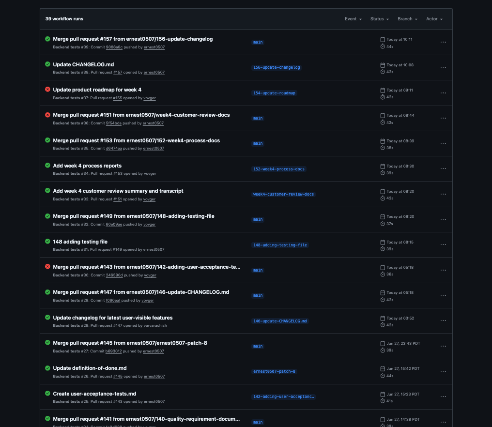

## 9. Additional QA Check

The team selected backend dependency audit as the additional QA check. This check helps detect vulnerable Python dependencies before changes are merged.

The dependency audit is part of the backend GitHub Actions workflow together with backend linting, backend startup verification, database migration checks, and backend tests with coverage reporting.

**Limitations:** dependency audit does not replace unit tests, integration tests, coverage analysis, manual review, or customer-facing UAT. It is used as an additional safety check in the CI pipeline.

## 10. Branch Protection and Pull Request Workflow

The repository uses a protected `main` branch workflow. Pull requests are required before merging to `main`, and at least one approval is required before merge.

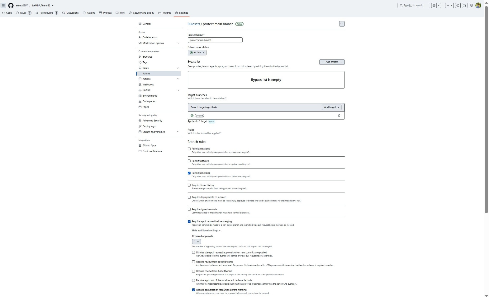

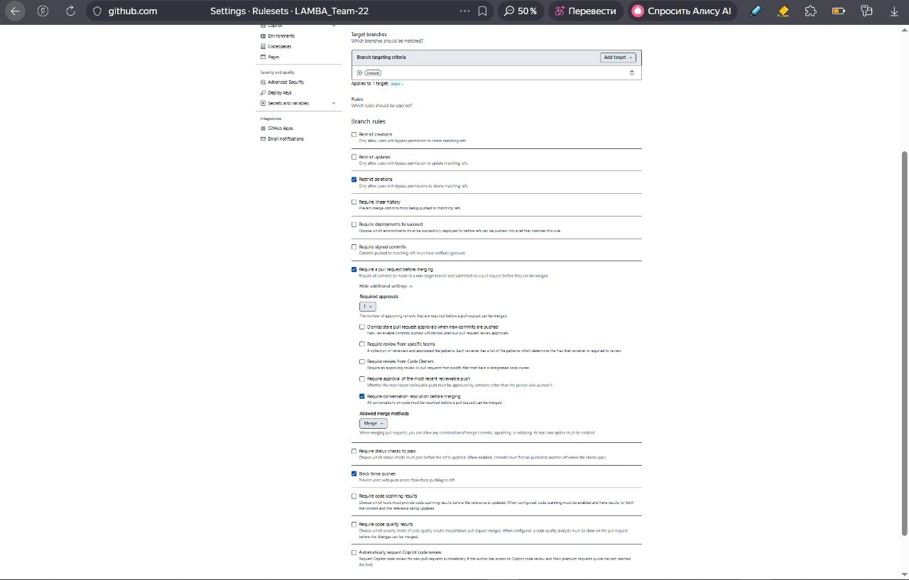

## 11. Sprint Review, Retrospective, Reflection, and LLM Usage

- **Customer review summary:** [customer-review-summary.md](customer-review-summary.md)
- **Customer review transcript:** [customer-review-transcript.md](customer-review-transcript.md)
- **Retrospective:** [retrospective.md](retrospective.md)
- **Reflection:** [reflection.md](reflection.md)
- **LLM usage report:** [llm-report.md](llm-report.md)

## 12. Retrospective Summary

The team achieved the main Sprint Goal and received direct customer feedback. Frontend and backend synchronization improved compared to the previous Sprint, which helped the team complete more tasks.

The main issues were remaining placeholders in the application and late introduction of tests after implementation. For the next Sprint, the team plans to add tests before merging GitHub PRs and check the application for forgotten placeholders before customer-facing demos.

## 13. Team Contribution Traceability

| Team member / GitHub | Main Week 4 contribution | Evidence |
|---|---|---|
| Ernest / `ernest0507` | AI chat UI, automated test work, quality requirement documentation, product coordination | PRs #139, #133, #141 |
| Gleb / `GxyzD` | AI assistant backend config, message endpoint, backend service work, rework/reverts | PRs #122, #127, #130, #129, #131 |
| Maya / `kysadakka` | AI assistant schemas, extraction service, backend validation tests, related rework | PRs #125, #126, #128, #137 |
| Varvara / `varvarachizh` | Maintenance and repair record screens | PR #119 |
| Ildar / `ItsShonn` | Record type selection and expense form screens | PR #124 |
| Vladimir / `vovger` | Customer review summary and transcript; retrospective, reflection, and LLM report; roadmap update; Week 4 repository report | PR #151, PR #153, PR #154, this README PR |

## 14. Screenshots and Visual Evidence

The following screenshots are stored in `reports/week4/images/` and referenced as evidence in this report.

| Screenshot | Path | Purpose |
|---|---|---|
| Sprint Backlog | `reports/week4/images/sprint-backlog.png` | Shows Sprint scope, Story Points, and Done items. |
| Week 4 Pull Requests | `reports/week4/images/week4-pull-requests.png` | Shows merged/approved PR evidence for Week 4. |
| Product Backlog Updates | `reports/week4/images/product-backlog-updates.png` | Shows Product Backlog items and customer-feedback follow-up status. |
| Week 4 release | `reports/week4/images/release.png` | Shows the published `v0.2.0` release. |
| Backend tests run | `reports/week4/images/backend-tests-run.png` | Shows backend tests workflow evidence. |
| Branch protection ruleset overview | `reports/week4/images/branch-protection-ruleset-overview.png` | Shows repository ruleset evidence. |
| Branch protection review rules | `reports/week4/images/branch-protection-ruleset-review-rules.png` | Shows PR/approval branch protection settings. |
| Documentation PRs | `reports/week4/images/documentation-prs.png` | Shows merged Week 4 documentation PRs. |
| Customer review issue template | `reports/week4/images/customer-review-issue-template.png` | Shows issue template / completion-criteria evidence for documentation work. |
| Login screen | `reports/week4/images/uat-login.png` | Evidence for the login UAT flow. |
| Registration screen | `reports/week4/images/uat-registration.png` | Evidence for the registration UAT flow. |
| Home screen with AI chat | `reports/week4/images/uat-ai-chat-home.png` | Evidence for AI-agent chat entry point. |
| AI expense confirmation | `reports/week4/images/uat-ai-chat-expense-confirmation.png` | Evidence that AI expense recording returns a saved-record confirmation. |
| Car digital twin with AI chat | `reports/week4/images/uat-car-digital-twin-ai-chat.png` | Evidence for digital twin + AI chat integration. |
| Navigation menu / garage | `reports/week4/images/uat-navigation-menu.png` | Evidence for garage navigation and product sections. |
| Expense/history timeline | `reports/week4/images/uat-expense-history.png` | Evidence for expense/history timeline. |
| Expense form | `reports/week4/images/uat-expense-form.png` | Evidence for manual expense record creation. |
| Record type selection | `reports/week4/images/uat-record-type-selection.png` | Evidence for note/record type selection screen. |
| Breakdown form | `reports/week4/images/uat-breakdown-form.png` | Evidence for breakdown record creation form. |
| Maintenance form | `reports/week4/images/uat-maintenance-form.png` | Evidence for maintenance record creation form. |

### Sprint and Repository Evidence

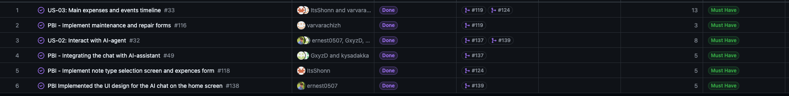

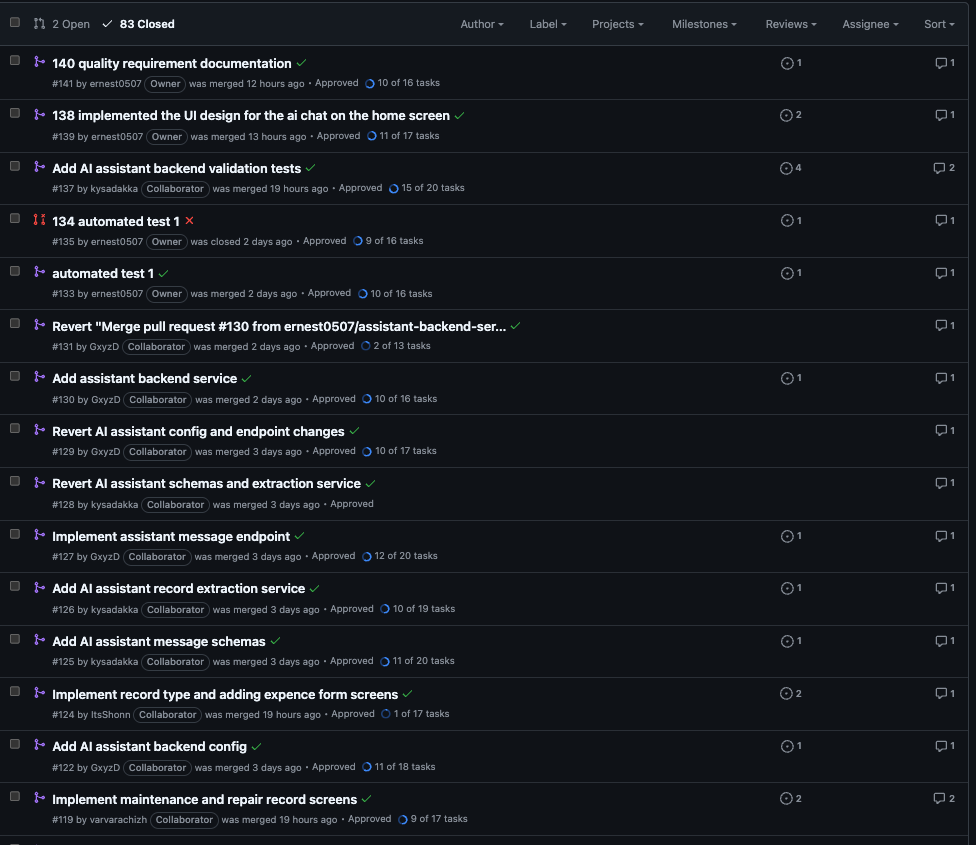

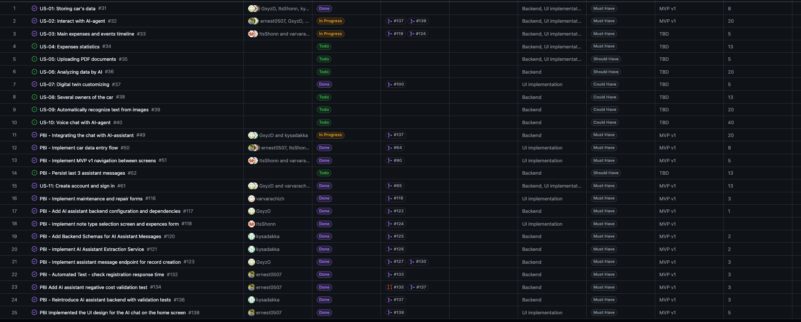

### Application Screenshots

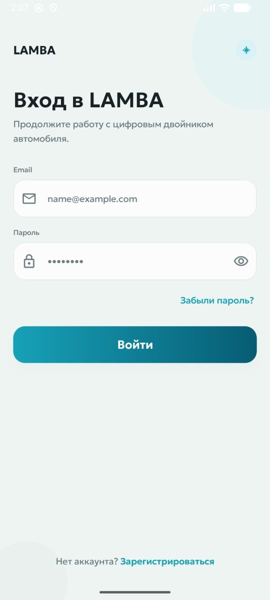

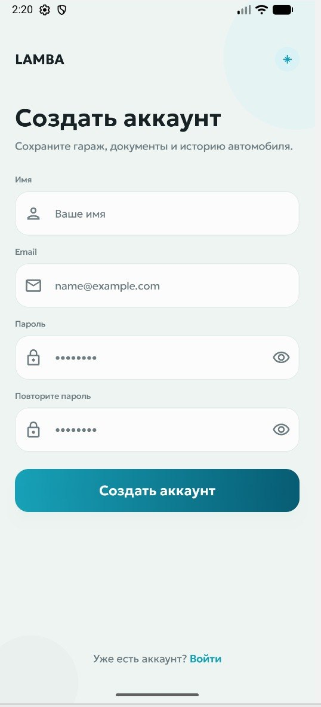

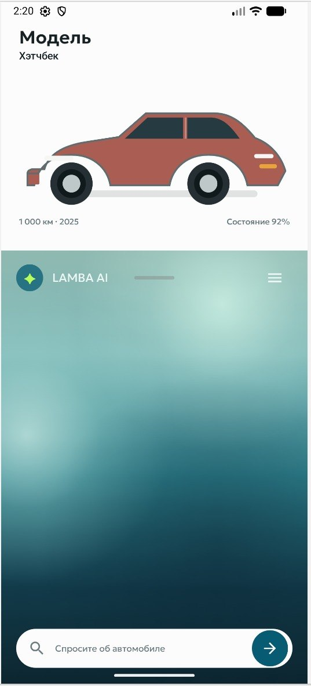

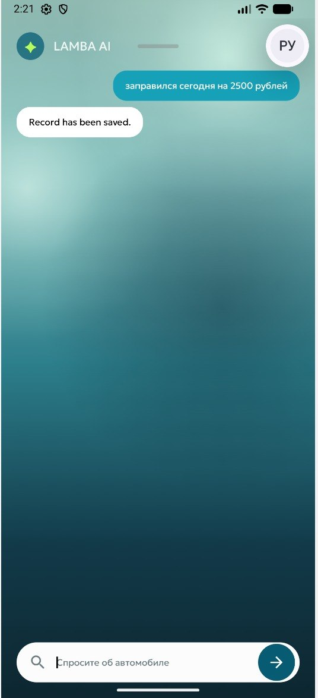

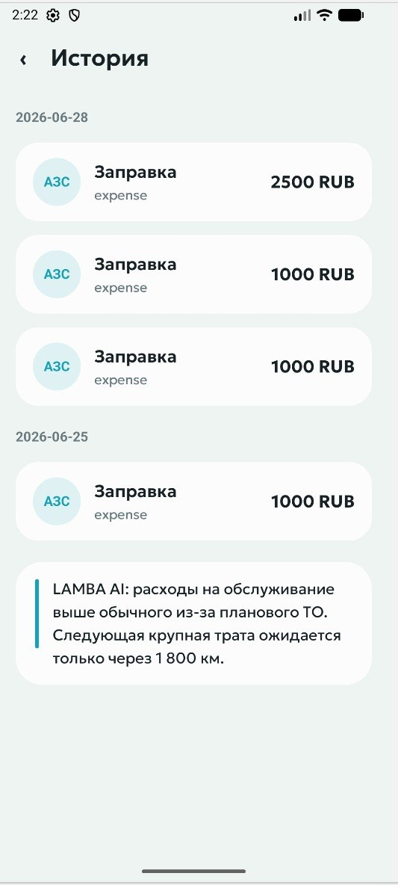

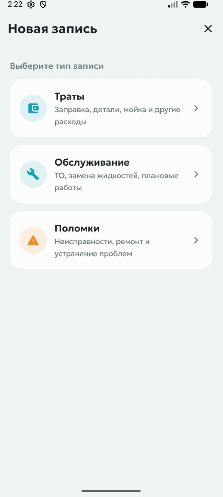

## 15. Product Status and Next Steps

The Week 4 release provides a working MVP increment with AI chat, expense recording, record forms, timeline/history views, and quality documentation. The customer accepted the demonstrated UAT scenarios but requested usability improvements for the next Sprint.

Next Sprint focus:

- add sign-out/logout flow;
- add clearer registration loading/success feedback;
- improve body type and brand/model selection;
- improve car placeholder/image;
- refine AI assistant tone/personality as the user's car assistant;
- improve chat history support beyond short-term persistence;
- continue maintaining tests, quality requirement tests, CI checks, and release documentation.
