# Week 6 Report — LAMBA Team 22

**Project:** LAMBA  
**Team:** Team 22  
**Assignment:** Assignment 6 / Sprint 4  
**Sprint dates:** 06.07–12.07  
**Delivered increment:** Week 6 transition-readiness trial increment  
**Sprint size:** 61 Story Points  
**Report status:** Final Week 6 public report.

## 1. Project overview

LAMBA is a mobile application for car owners. The product helps users maintain a digital car profile, record car-related expenses and events, review history and statistics, use an AI assistant, and track trips.

Week 6 focused on completing Sprint 4, preparing a customer-usable trial increment, reviewing transition readiness, improving customer-facing documentation, and identifying the remaining work required for the Week 7 final handover.

The product can already be used as a Week 6 trial product. However, the full transition is intentionally planned for Week 7 after Sprint 5, when the team will publish the final MVP v3 release, finalize handover documentation, prepare the source-code archive, decide whether prepared test accounts are still needed, and confirm customer-side operation.

## 2. Public project links

| Artifact | Link / status |
|---|---|
| Product repository | [LAMBA_Team-22](https://github.com/ernest0507/LAMBA_Team-22) |
| Product Backlog | [GitHub Project — Product Backlog](https://github.com/users/ernest0507/projects/2) |
| Sprint 4 milestone | [Milestone 4](https://github.com/ernest0507/LAMBA_Team-22/milestone/4) |
| Sprint 4 Backlog board | [Sprint 4 — MVP v3](https://github.com/users/ernest0507/projects/8/views/1) |
| Hosted documentation site | [LAMBA Maintained Documentation](https://ernest0507.github.io/LAMBA_Team-22/) |
| Week 6 trial release | [v0.3.1 - Week 6 Trial Release](https://github.com/ernest0507/LAMBA_Team-22/releases/tag/v0.3.1) |
| Product access artifact / APK | [Download the Week 6 APK from Google Drive](https://drive.google.com/file/d/1GJE0OONoq9pnoVfVhQG0RGEbBOTZllVh/view?usp=drive_link) |
| Customer handover document | [docs/customer-handover.md](../../docs/customer-handover.md) |
| Contributor guidance | [CONTRIBUTING.md](../../CONTRIBUTING.md) |
| AI/agent repository guidance | [AGENTS.md](../../AGENTS.md) |

## 3. Sprint 4 overview

### Sprint Goal

The Sprint 4 goal was to prepare a stable Week 6 trial product that the customer could review and use before final transition. The sprint focused on trip mode, QR/refueling support, driver-mode UI, achievements, frontend-backend integration, reliability fixes, and transition-readiness documentation.

### Sprint facts

| Field | Value |
|---|---|
| Sprint | Sprint 4 / Week 6 |
| Start date | 06.07 |
| Finish date | 12.07 |
| Total Sprint size | 61 Story Points |
| Milestone | [Milestone 4](https://github.com/ernest0507/LAMBA_Team-22/milestone/4) |
| Board state | All selected Sprint 4 items shown in the submitted board evidence were in `Done` |
| Increment type | Customer-usable Week 6 trial increment |
| Final handover state | Not final; planned for Week 7 after Sprint 5 |

## 4. Delivered Sprint 4 changes

| Area | Delivered change | Traceability | Status |
|---|---|---|---|
| Trip mode | Added trip tracking, trip metrics, point synchronization, foreground tracking, trip APIs, and final mileage update. | [#175](https://github.com/ernest0507/LAMBA_Team-22/issues/175), [#226](https://github.com/ernest0507/LAMBA_Team-22/issues/226), [#227](https://github.com/ernest0507/LAMBA_Team-22/issues/227), [#230](https://github.com/ernest0507/LAMBA_Team-22/issues/230), [#231](https://github.com/ernest0507/LAMBA_Team-22/issues/231) | Done |
| QR/refueling | Added backend QR scan support and connected the receipt QR scan flow between Android/frontend and backend. | [#176](https://github.com/ernest0507/LAMBA_Team-22/issues/176), [#245](https://github.com/ernest0507/LAMBA_Team-22/issues/245), [#251](https://github.com/ernest0507/LAMBA_Team-22/issues/251) | Done for Sprint 4 scope; customer follow-up remains |
| Driver mode | Implemented driver-mode UI and connected it with backend API behavior. | [#235](https://github.com/ernest0507/LAMBA_Team-22/issues/235), [#242](https://github.com/ernest0507/LAMBA_Team-22/issues/242) | Done |
| Achievements | Added achievement UI and backend support for manual and automatic achievement behavior. | [#238](https://github.com/ernest0507/LAMBA_Team-22/issues/238), [#250](https://github.com/ernest0507/LAMBA_Team-22/issues/250), [#254](https://github.com/ernest0507/LAMBA_Team-22/issues/254) | Done for Sprint 4 scope |
| Authentication | Added backend logout support. | [#240](https://github.com/ernest0507/LAMBA_Team-22/issues/240) | Done |
| Reliability | Fixed assistant memory and breakdown handling. | [#219](https://github.com/ernest0507/LAMBA_Team-22/issues/219) | Done |
| Car creation UX | Connected brand/model autocomplete fields to the car creation flow. | [PR #248](https://github.com/ernest0507/LAMBA_Team-22/pull/248) | Done |
| Transition documentation | Prepared and published customer handover, contributor/agent guidance, customer-trial evidence, retrospective, reflection, and LLM disclosure. | [PR #259](https://github.com/ernest0507/LAMBA_Team-22/pull/259), [PR #263](https://github.com/ernest0507/LAMBA_Team-22/pull/263) | Done |

## 5. Transition-readiness meeting and customer trial

The Week 6 customer meeting reviewed the current product state, customer-facing documentation, deployment expectations, final handover level, and the remaining Week 7 work.

The product is already usable as a Week 6 trial release. The customer tried the current product flow during the meeting and provided feedback. The full transition is not yet complete and is planned for Week 7 after Sprint 5.

Detailed evidence:

- [Part 5 transition-readiness meeting report](part5-transition-readiness-meeting.md)
- [Sprint Review / customer meeting transcript](sprint-review-transcript.md)
- [Sprint Review / customer meeting summary](sprint-review-summary.md)

### Required discussion points

| Required point | Week 6 result |
|---|---|
| Is the product complete enough for transition? | It is complete enough for trial use and customer review, but not yet for final transition. |
| Which parts are ready? | Core product flows, trip mode, QR/refueling Sprint 4 scope, driver-mode UI, achievements, logout, and frontend-backend integration are available in the current increment. |
| Which parts still need changes? | Final visual polish, additional Sprint 5 features, final release packaging, final customer-facing documentation, customer-side operation confirmation, source-code archive, and optional test accounts remain. Detailed backend deployment documentation is intentionally deferred to Week 7. |
| Is the customer already using the product? | The customer can already use the trial product and tried product flows during the Week 6 meeting. |
| Why is full independent use not yet the final state? | The final release and transition package are planned for Week 7, and some handover/deployment actions remain. |
| Is the product deployed or operated on the customer side? | No. Customer-side operation is the target state for Week 7 final handover. |
| What must happen in Week 7? | Finish the additional Sprint 5 features and visual polish, publish the final MVP v3 release, finalize customer-facing and backend deployment documentation, prepare the source archive, decide on test accounts, and complete the final customer transition. |
| How can the product remain useful after delivery? | Provide stable artifacts, detailed setup/deployment guidance, troubleshooting notes, source archive, maintainable documentation, and clear ownership/access arrangements. |
| Customer documentation feedback | Detailed deployment documentation is a must-have; hosted documentation should be exportable as PDF if practical. |

### Customer-facing documentation review

This table records the customer's feedback about the Assignment 6 customer-facing documentation set. “Clear”, “unclear”, and “missing” refer to what the customer understood during the review, not to a grading result.

| Review category | Week 6 customer feedback |
|---|---|
| Clear | The general handover direction was understandable: the current product can be used as a trial, the APK may be distributed through a GitHub Release and Google Drive, and the final target is customer-side operation after Week 7 work. |
| Unclear | The exact final customer-side backend deployment and maintenance procedure was not yet clear enough because the detailed backend deployment documentation is intentionally deferred until Week 7. |
| Missing | Final customer-side backend deployment instructions, the final source-code archive, the final decision on prepared test accounts, and an exportable PDF copy of hosted documentation remain Week 7 work. |

### Required transition-readiness checkpoints

| Checkpoint | Week 6 status |
|---|---|
| Customer confirmed readiness for independent use after Week 7 work | Direction accepted, but final confirmation remains for Week 7 after follow-up work. |
| Customer independently used the trial release | Partially. The customer tried the APK/product flow during the meeting; package/version issues affected completely independent use. |
| Product deployed or operated on customer side | No. This is the final Week 7 target. |

## 6. Customer feedback response table

| Customer feedback / finding | Resulting issue, PBI, or transition action | Status / target |
|---|---|---|
| APK/cloud access is acceptable. | Publish `v0.3.1`, upload APK to Google Drive, and link the APK from the release. | Completed in Week 6 |
| Full source code should be handed over, not only repository access. | Prepare a complete backend/frontend source-code archive after Sprint 5 scope is finalized. | Week 7 |
| Backend should ultimately run on the customer side. | Finalize deployment instructions and confirm customer-side operation. | Week 7 |
| Detailed deployment and launch documentation is required. | Update backend README, root README, and customer handover instructions. | Week 6/7 |
| Hosted documentation should be exportable as PDF. | Prepare a PDF export if practical. | Week 7 |
| Prepared accounts with example data may help future maintainers. | Decide after Sprint 5 whether accounts are still needed; share credentials privately if created. | Week 7 |
| APK package/name/icon caused confusion. | Fix application identity and visual branding. | Sprint 5 follow-up |
| QR receipt behavior should create a refueling record rather than only a generic expense. | Refine QR/refueling behavior based on customer trial feedback. | Sprint 5 follow-up |
| QR entry point was not obvious. | Improve discoverability or clarify instructions. | Sprint 5 follow-up |
| Car/wheel visual assets need polish. | Improve image scaling and visual consistency. | Sprint 5 follow-up |
| Duplicate receipts should be prevented. | Store receipt identifiers and prevent duplicate record creation. | Sprint 5 follow-up |

### Feedback not yet addressed

Some customer feedback is intentionally not completed in Week 6 because the team is still developing additional features and will perform the full product transition in Week 7. Visual polish, application identity, QR/refueling refinements, duplicate receipt prevention, finalized backend deployment documentation, source-code archive preparation, and the decision about test accounts remain Week 7 follow-up work.

The Sprint 4 board screenshot provides traceability for the completed Sprint 4 PBIs and linked PRs. Items that remain unresolved are recorded as explicit Week 7 transition actions and should be converted into Sprint 5 issues when Sprint 5 is started.

## 7. Customer-executed UAT / trial summary

The same Week 6 meeting was used as customer-trial and Sprint Review/UAT evidence. Exact private recording links and exact private timecodes are kept for Moodle only.

| Trial / UAT area | Result | Notes |
|---|---|---|
| APK installation and access | Passed with comments | The customer accessed the trial flow, but package/version identity created installation confusion. |
| Registration and car profile | Passed with comments | The customer reviewed registration and car selection; manual fallback remains useful for missing models. |
| Trip mode | Reviewed / current scope accepted | Trip mode significantly improved the product and was completed in Sprint 4. |
| QR/refueling | Partially passed | QR processing worked, but the resulting record semantics and entry-point clarity need follow-up. |
| Achievements | Reviewed | Sprint 4 achievement work was completed; final polish may continue in Sprint 5. |
| Documentation | Reviewed with follow-up | Customer requested detailed deployment guidance and exportable documentation. |
| Customer-side operation | Not yet performed | Planned for the final Week 7 transition. |

## 8. Sprint Review and meeting artifacts

| Artifact | Link |
|---|---|
| Transition-readiness meeting report | [part5-transition-readiness-meeting.md](part5-transition-readiness-meeting.md) |
| Sprint Review / customer meeting transcript | [sprint-review-transcript.md](sprint-review-transcript.md) |
| Sprint Review / customer meeting summary | [sprint-review-summary.md](sprint-review-summary.md) |
| Private meeting recording | Moodle/private evidence only |
| Exact private timecodes | Moodle/private evidence only |

The public transcript and summary may be committed. Credentials, private recording links, and exact private timecodes must not be added to the public repository.

## 9. Customer-facing and maintained documentation

| Artifact | Link / status |
|---|---|
| Customer handover | [docs/customer-handover.md](../../docs/customer-handover.md) |
| Root project README | [README.md](../../README.md) - updated with Week 6 release, APK, documentation, and run instructions |
| Contributor guide | [CONTRIBUTING.md](../../CONTRIBUTING.md) |
| Agent/AI repository guide | [AGENTS.md](../../AGENTS.md) |
| Backend setup and run instructions | [backend/README.md](../../backend/README.md) |
| Environment variable template | [backend/.env.example](../../backend/.env.example) |
| Hosted documentation site | [LAMBA Maintained Documentation](https://ernest0507.github.io/LAMBA_Team-22/) |
| Roadmap | [docs/roadmap.md](../../docs/roadmap.md) |
| Definition of Done | [docs/definition-of-done.md](../../docs/definition-of-done.md) |
| Development process | [docs/development-process.md](../../docs/development-process.md) |
| Testing overview | [docs/testing.md](../../docs/testing.md) |
| Quality requirements | [docs/quality-requirements.md](../../docs/quality-requirements.md) |
| Quality requirement tests | [docs/quality-requirement-tests.md](../../docs/quality-requirement-tests.md) |
| User Acceptance Tests | [docs/user-acceptance-tests.md](../../docs/user-acceptance-tests.md) |
| Architecture overview | [docs/architecture/README.md](../../docs/architecture/README.md) |
| Static architecture view | [docs/architecture/static-view/](../../docs/architecture/static-view/) |
| Dynamic architecture view | [docs/architecture/dynamic-view/](../../docs/architecture/dynamic-view/) |
| Deployment architecture view | [docs/architecture/deployment-view/](../../docs/architecture/deployment-view/) |
| Architecture Decision Records | [docs/architecture/adr/](../../docs/architecture/adr/) |
| CHANGELOG | [CHANGELOG.md](../../CHANGELOG.md) |

### Architecture documentation status

The maintained architecture set documents the Android client, FastAPI backend, PostgreSQL/Alembic persistence, REST integration, external AI provider, and deployment model. Sprint 4 did not change this high-level deployment model. Before final submission, the team should verify that the architecture overview still accurately reflects the delivered trip-tracking, QR/refueling, and achievement-related backend/API responsibilities. If the high-level boundaries remain unchanged, a short wording update is sufficient; new diagrams are not required only for the sake of Assignment 6.

## 10. Testing, review, and CI status

Sprint 4 implementation work was handled through issue-linked pull requests. Acceptance criteria and relevant checks should be verified before merge according to the maintained development process and Definition of Done.

| Evidence | Link / status |
|---|---|
| GitHub Actions | [Repository Actions](https://github.com/ernest0507/LAMBA_Team-22/actions) |
| Backend test workflow | `.github/workflows/backend-tests.yml` |
| Documentation workflow | `.github/workflows/docs.yml` |
| Link checker | `.github/workflows/lychee.yml` |
| Testing documentation | [docs/testing.md](../../docs/testing.md) |
| Quality requirement tests | [docs/quality-requirement-tests.md](../../docs/quality-requirement-tests.md) |
| Definition of Done | [docs/definition-of-done.md](../../docs/definition-of-done.md) |
| Successful backend CI evidence | A successful `backend-tests.yml` run is embedded below. |

## 11. Release and product access

| Artifact | Week 6 status |
|---|---|
| SemVer release | [`v0.3.1 - Week 6 Trial Release`](https://github.com/ernest0507/LAMBA_Team-22/releases/tag/v0.3.1) |
| APK Google Drive link | [Week 6 APK product access artifact](https://drive.google.com/file/d/1GJE0OONoq9pnoVfVhQG0RGEbBOTZllVh/view?usp=drive_link) |
| Release-to-milestone mapping | The release links to [Milestone 4](https://github.com/ernest0507/LAMBA_Team-22/milestone/4). |
| Protected-default-branch basis | The release tag points to the accepted `main` state shown on the release page. |
| Run/access instructions | Download the APK, open it on an Android device or emulator, allow installation from the browser/file manager if required, install, launch, and register a new account. |
| Fixed test credentials | Not required for the Week 6 trial build. |
| Final MVP v3 release | Planned for Week 7 after Sprint 5. |

### Release evidence

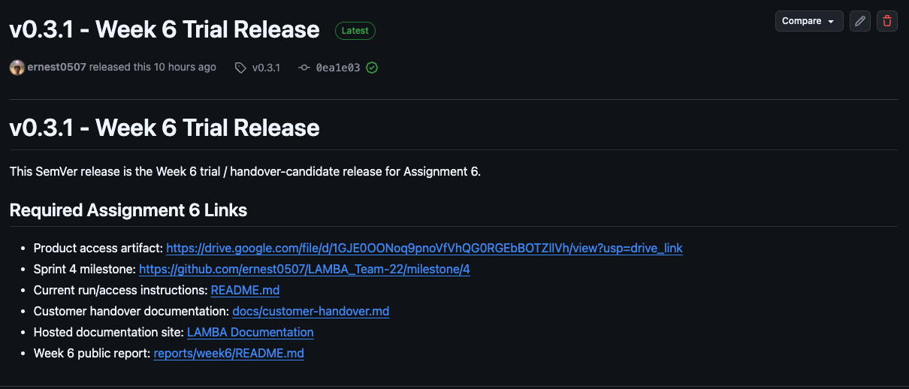

## 12. Week 6 process artifacts

| Artifact | Link |
|---|---|
| Transition-readiness meeting report | [part5-transition-readiness-meeting.md](part5-transition-readiness-meeting.md) |
| Sprint Review summary | [sprint-review-summary.md](sprint-review-summary.md) |
| Sprint Review transcript | [sprint-review-transcript.md](sprint-review-transcript.md) |
| Retrospective | [retrospective.md](retrospective.md) |
| Reflection | [reflection.md](reflection.md) |
| LLM usage report | [llm-report.md](llm-report.md) |

## 13. Retrospective and reflection summary

The Week 6 retrospective was discussed asynchronously in the team chat.

Main observations:

- implementing trip mode significantly improved the product even though it was not originally expected in the MVP;
- the team became faster because members were more familiar with the environment and development workflow;
- version confusion made it difficult to identify the correct build for the customer demonstration;
- frontend-backend synchronization remained a recurring coordination issue;
- all team members participated;
- Sprint 5 should focus on visual polish, documentation, final release, and customer handover.

Detailed files:

- [retrospective.md](retrospective.md)
- [reflection.md](reflection.md)

## 14. LLM usage disclosure

An LLM was used only as a drafting and structuring assistant. The team manually reviewed, corrected, and approved all final text. It was not used as an independent source of evidence or to invent repository status, customer confirmation, release links, credentials, or completion claims.

Detailed disclosure:

- [llm-report.md](llm-report.md)

## 15. Contribution traceability

The table below uses merged Week 6 PR evidence where it is already available. Contribution evidence below reflects the merged Sprint 4 implementation and Week 6 documentation work.

| Team member | Week 6 contribution | Issues / PRs / evidence |
|---|---|---|
| Maya Gavrilova (`kysadakka`) | Implemented backend trip APIs and achievement backend work, including follow-up reliability fixes. | [PR #234](https://github.com/ernest0507/LAMBA_Team-22/pull/234), [PR #236](https://github.com/ernest0507/LAMBA_Team-22/pull/236), [PR #253](https://github.com/ernest0507/LAMBA_Team-22/pull/253), [PR #255](https://github.com/ernest0507/LAMBA_Team-22/pull/255), [PR #257](https://github.com/ernest0507/LAMBA_Team-22/pull/257) |
| Gleb Demchin (`GxyzD`) | Worked on assistant reliability, trip models/metrics, Android trip tracking and sync, mileage update, backend QR scanning, and logout support. | [PR #220](https://github.com/ernest0507/LAMBA_Team-22/pull/220), [PR #228](https://github.com/ernest0507/LAMBA_Team-22/pull/228), [PR #229](https://github.com/ernest0507/LAMBA_Team-22/pull/229), [PR #232](https://github.com/ernest0507/LAMBA_Team-22/pull/232), [PR #233](https://github.com/ernest0507/LAMBA_Team-22/pull/233), [PR #241](https://github.com/ernest0507/LAMBA_Team-22/pull/241), [PR #244](https://github.com/ernest0507/LAMBA_Team-22/pull/244), [PR #246](https://github.com/ernest0507/LAMBA_Team-22/pull/246) |
| Vladimir Germanov (`vovger`) | Coordinated Week 6 reporting and prepared customer-facing/process documentation artifacts, including handover, meeting evidence, retrospective, reflection, LLM disclosure, repository guidance, and roadmap updates. | [PR #259](https://github.com/ernest0507/LAMBA_Team-22/pull/259), [PR #263](https://github.com/ernest0507/LAMBA_Team-22/pull/263), [Issue #258](https://github.com/ernest0507/LAMBA_Team-22/issues/258), [Issue #262](https://github.com/ernest0507/LAMBA_Team-22/issues/262) |
| Ernest Kashapov (`ernest0507`) | Coordinated product/customer work and contributed driver-mode UI/API integration and QR scan frontend-backend integration. | [PR #237](https://github.com/ernest0507/LAMBA_Team-22/pull/237), [PR #243](https://github.com/ernest0507/LAMBA_Team-22/pull/243), [PR #252](https://github.com/ernest0507/LAMBA_Team-22/pull/252) |
| Varvara Chizhikova (`varvarachizh`) | Participated in team work during Sprint 4 according to the retrospective. | No Sprint 4 PR is available yet; add issue/PR/review/testing evidence if it becomes available before final submission. |
| Ildar Faskhutdinov (`itsshonn`) | Connected car brand/model autocomplete and implemented the achievements screen/sidebar entry. | [PR #248](https://github.com/ernest0507/LAMBA_Team-22/pull/248), [PR #249](https://github.com/ernest0507/LAMBA_Team-22/pull/249) |

All team members participated according to the Week 6 retrospective. Varvara's Sprint 4 contribution was team participation without a separate Sprint 4 PR in the available public evidence.

## 16. Public evidence screenshots

### Sprint 4 Backlog board

The board shows the completed Sprint 4 scope, linked PRs, MVP v3 mapping, and Story Point values.

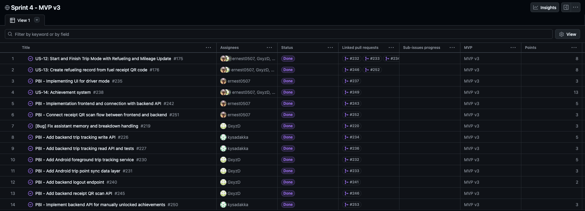

### Sprint 4 milestone

The milestone shows the Sprint Goal, Sprint dates, and 100% completion.

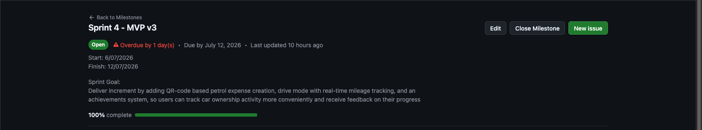

### Successful backend CI run

The GitHub Actions evidence shows successful backend lint, dependency audit, and backend test jobs.

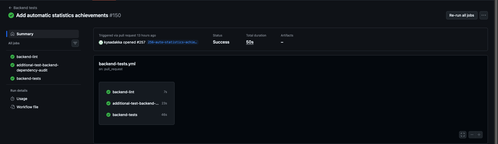

### Reviewed issue-linked pull request

PR #257 is linked to issue #256, was reviewed by another team member, passed checks, and was merged into `main`.

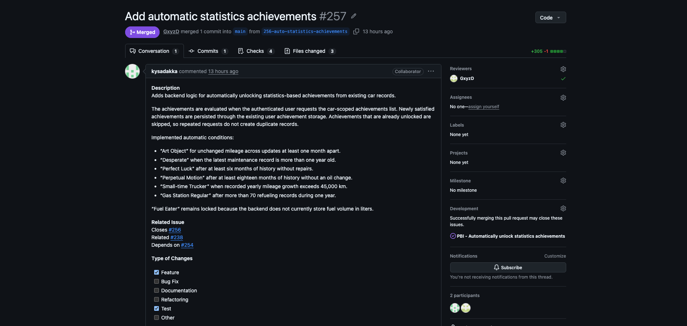

### Week 6 release

### Product screenshots

The following screenshots show the delivered Week 6 trial flow: digital-twin creation, vehicle setup, trip mode, navigation, QR scanning, and the created refueling/expense history record.

  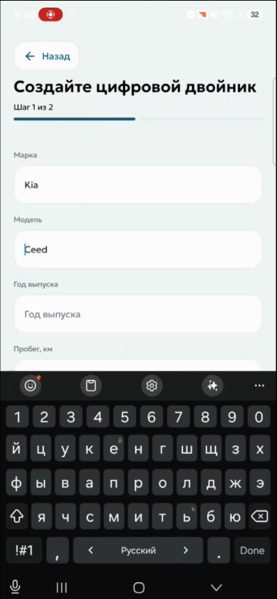
  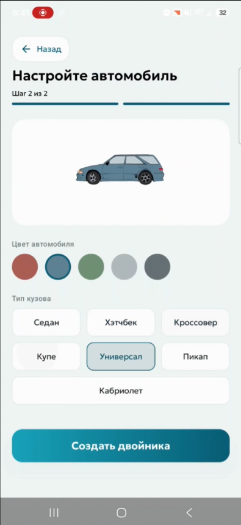
  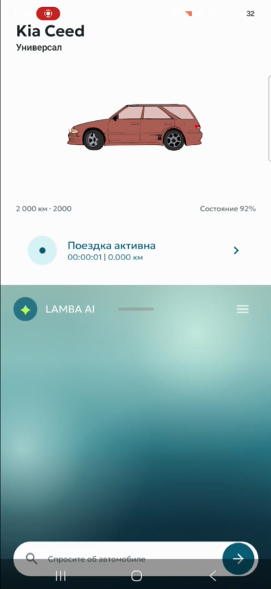

  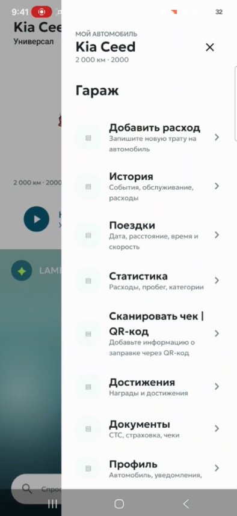
  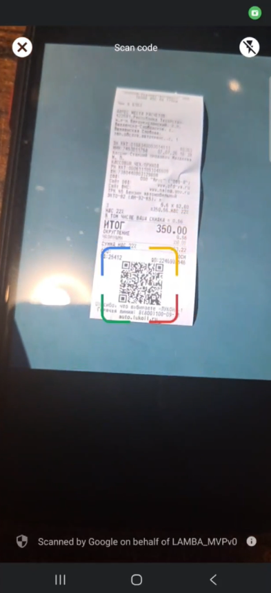
  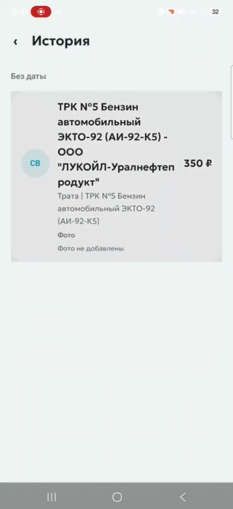

## 17. Expected Sprint 5 follow-up

Part 6 is a Week 7 activity and is not claimed as completed in this Week 6 report.

Sprint 5 is expected to focus on:

- visual polish and product identity;
- QR/refueling follow-up and duplicate receipt prevention;
- frontend-backend synchronization;
- final customer-facing documentation;
- final release preparation;
- customer-side deployment and operation guidance;
- source-code archive preparation after Sprint 5 scope is finalized;
- prepared test accounts only if they are still needed;
- final customer handover and confirmation.

## 18. Week 6 conclusion

Sprint 4 was a successful 61 Story Point sprint. The team completed a customer-usable trial increment and significantly improved the product through trip mode and related integration work.

The product is already usable by the customer as a trial product, but final transition has not yet been claimed. The remaining release, documentation, deployment, and handover work will be completed in Week 7 through Sprint 5.
