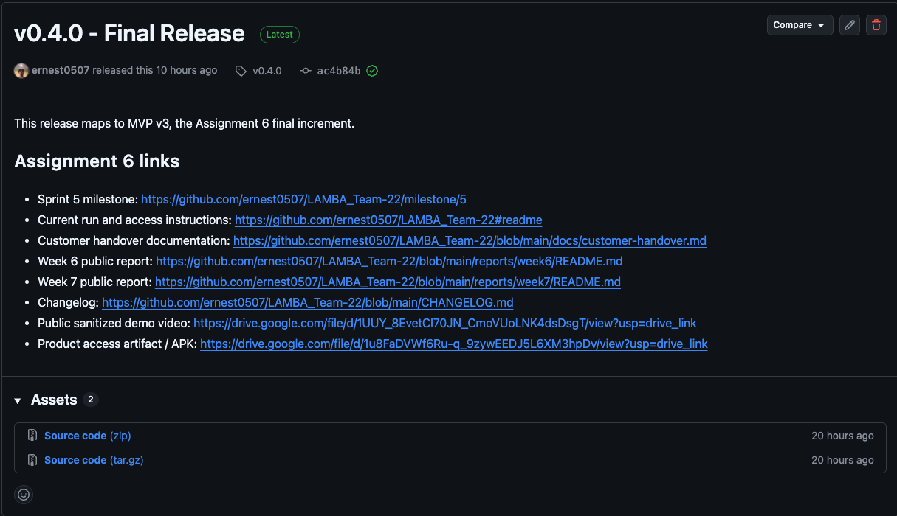
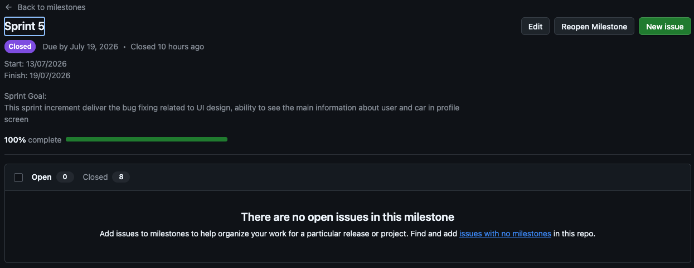
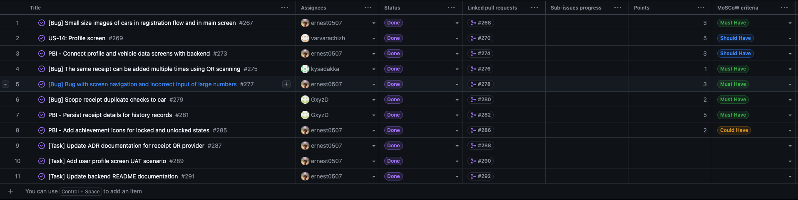
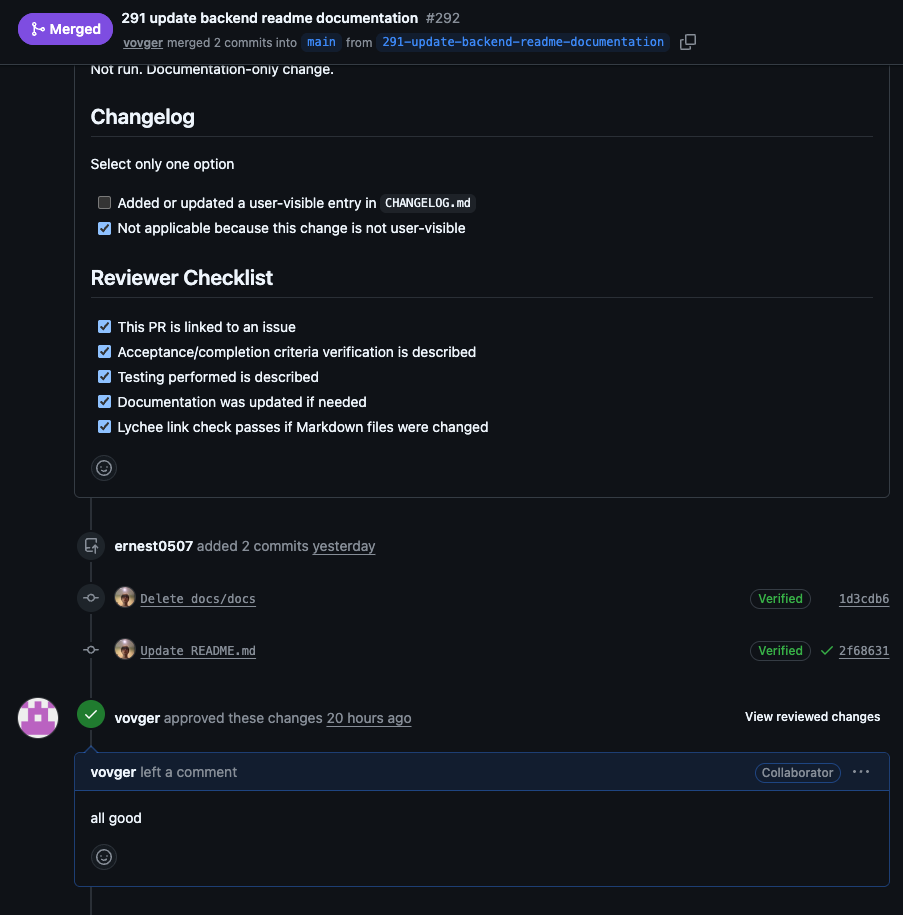
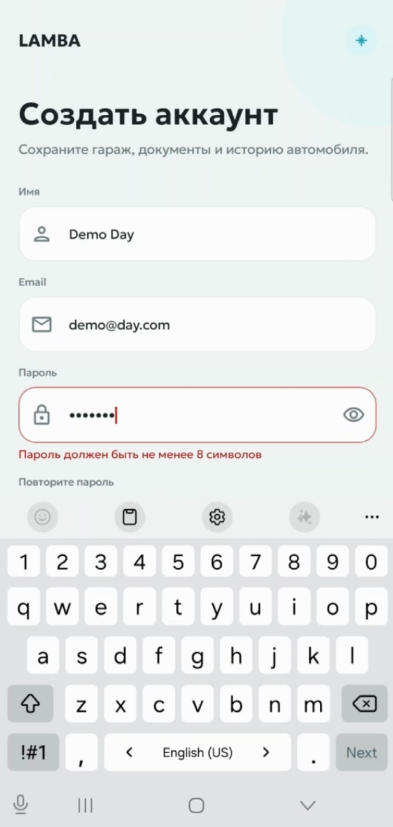
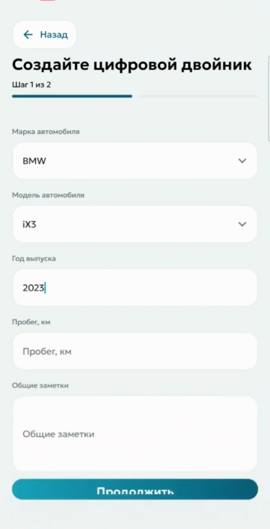
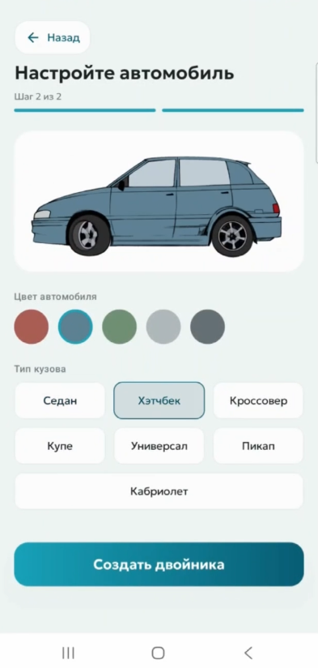
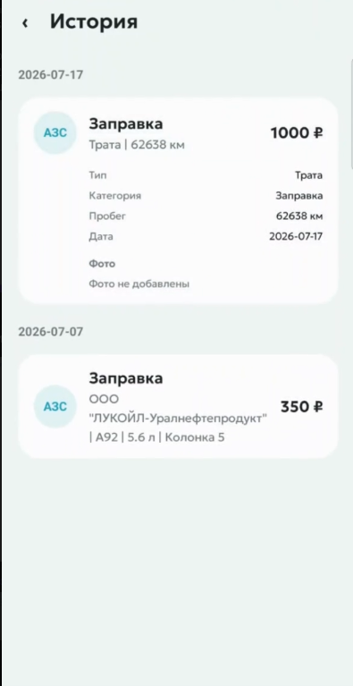
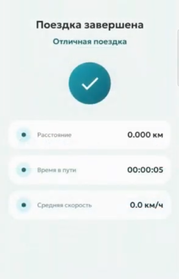

# Week 7 Report — LAMBA Team 22

**Project:** LAMBA  
**Team:** Team 22  
**Assignment:** Assignment 6 / Sprint 5  
**Sprint dates:** 13.07.2026–19.07.2026  
**Delivered increment:** Final MVP v4  
**Sprint size:** 24 Story Points  
**Report status:** Final Week 7 public report

## 1. Project overview

LAMBA is an Android application for car owners. It provides a digital vehicle profile, car-related history and expenses, statistics, an AI assistant, trip tracking, receipt QR scanning, achievements, profile management, and application settings.

Week 7 focused on completing Sprint 5, delivering the final MVP v4 increment, resolving the remaining customer-trial findings, preparing the final release and source archive, and completing the customer handover package.

The final delivery is prepared for independent customer-side use. The customer accepted the completed handover package. The customer is responsible for deploying and operating the backend on customer-managed infrastructure.

Assignment 6 names the final course increment MVP v3. The team repository uses the label **MVP v4** because the internal MVP sequence advanced earlier; release `v0.4.0` is the final Assignment 6 course increment.

## 2. Public project links

| Artifact | Link / status |
|---|---|
| Product repository | [LAMBA_Team-22](https://github.com/ernest0507/LAMBA_Team-22) |
| Previous report | [Week 6 Report](../week6/README.md) |
| Product Backlog | [GitHub Project — Product Backlog](https://github.com/users/ernest0507/projects/2) |
| Sprint 5 milestone | [Milestone 5](https://github.com/ernest0507/LAMBA_Team-22/milestone/5) |
| Sprint 5 Backlog board | [Sprint 5 Project](https://github.com/users/ernest0507/projects/9) |
| Final release | [v0.4.0](https://github.com/ernest0507/LAMBA_Team-22/releases/tag/v0.4.0) |
| Final APK | [LAMBA_Team22_v0.4.0.apk](https://drive.google.com/file/d/1u8FaDVWf6Ru-q_9zywEEDJ5L6XM3hpDv/view?usp=drive_link) |
| Source-code archive | [LAMBA_Team22.zip](https://drive.google.com/file/d/1g7qxBIab1TvOp1CIxZWTWt7mmh-FeFiH/view?usp=drive_link) |
| Public demo video | [Final MVP v4 demo](https://drive.google.com/file/d/1UUY_8EvetCl70JN_CmoVUoLNK4dsDsgT/view?usp=drive_link) |
| Hosted documentation | [LAMBA Documentation](https://ernest0507.github.io/LAMBA_Team-22/) |
| Customer handover | [docs/customer-handover.md](../../docs/customer-handover.md) |
| Deployment guide | [docs/deployment-guide.md](../../docs/deployment-guide.md) |
| Repository README | [README.md](../../README.md) |
| Contributor guidance | [CONTRIBUTING.md](../../CONTRIBUTING.md) |
| AI/agent guidance | [AGENTS.md](../../AGENTS.md) |
| Roadmap | [docs/roadmap.md](../../docs/roadmap.md) |
| Changelog | [CHANGELOG.md](../../CHANGELOG.md) |

The full Sprint Review recording is retained as private Moodle evidence and is not linked from the public repository report.

## 3. Sprint 5 overview

### Sprint Goal

Complete the final MVP v4 delivery by resolving the remaining Week 6 customer-trial findings, improving product polish and reliability, finalizing customer-facing and deployment documentation, preparing the final release artifacts, and completing the agreed product transition.

### Sprint facts

| Field | Value |
|---|---|
| Sprint | Sprint 5 / Week 7 |
| Start date | 13.07.2026 |
| Finish date | 19.07.2026 |
| Total Sprint size | 24 Story Points |
| Milestone | [Milestone 5](https://github.com/ernest0507/LAMBA_Team-22/milestone/5) |
| Delivered MVP | MVP v4 |
| Release | [v0.4.0](https://github.com/ernest0507/LAMBA_Team-22/releases/tag/v0.4.0) |
| Increment type | Final delivery and customer-handover increment |

## 4. Delivered Sprint 5 changes

| Area | Delivered change | Traceability | Status |
|---|---|---|---|
| Profile and settings | Added the profile screen, vehicle-data editing, application settings, and a dedicated profile UAT scenario. | [#269](https://github.com/ernest0507/LAMBA_Team-22/issues/269), [PR #270](https://github.com/ernest0507/LAMBA_Team-22/pull/270), [#273](https://github.com/ernest0507/LAMBA_Team-22/issues/273), [PR #274](https://github.com/ernest0507/LAMBA_Team-22/pull/274), [#289](https://github.com/ernest0507/LAMBA_Team-22/issues/289), [PR #290](https://github.com/ernest0507/LAMBA_Team-22/pull/290) | Done |
| Receipt duplicate protection | Prevented repeated QR receipt creation and scoped duplicate checks to the relevant car. | [#275](https://github.com/ernest0507/LAMBA_Team-22/issues/275), [PR #276](https://github.com/ernest0507/LAMBA_Team-22/pull/276), [#279](https://github.com/ernest0507/LAMBA_Team-22/issues/279), [PR #280](https://github.com/ernest0507/LAMBA_Team-22/pull/280) | Done |
| Receipt history data | Persisted structured receipt details for history records. | [#281](https://github.com/ernest0507/LAMBA_Team-22/issues/281), [PR #282](https://github.com/ernest0507/LAMBA_Team-22/pull/282) | Done |
| Achievement visuals | Added separate visual states for locked and unlocked achievements. | [#285](https://github.com/ernest0507/LAMBA_Team-22/issues/285), [PR #286](https://github.com/ernest0507/LAMBA_Team-22/pull/286) | Done |
| Vehicle visuals | Increased vehicle-image visibility in registration and on the main screen. | [#267](https://github.com/ernest0507/LAMBA_Team-22/issues/267), [PR #268](https://github.com/ernest0507/LAMBA_Team-22/pull/268) | Done |
| UI reliability | Fixed confirmation-screen navigation and incorrect large-number input behavior. | [#277](https://github.com/ernest0507/LAMBA_Team-22/issues/277), [PR #278](https://github.com/ernest0507/LAMBA_Team-22/pull/278) | Done |
| Technical documentation | Updated receipt-provider ADR documentation, backend README, testing documentation, quality-requirement tests, and the changelog. | [#271](https://github.com/ernest0507/LAMBA_Team-22/issues/271), [PR #272](https://github.com/ernest0507/LAMBA_Team-22/pull/272), [#287](https://github.com/ernest0507/LAMBA_Team-22/issues/287), [PR #288](https://github.com/ernest0507/LAMBA_Team-22/pull/288), [#291](https://github.com/ernest0507/LAMBA_Team-22/issues/291), [PR #292](https://github.com/ernest0507/LAMBA_Team-22/pull/292), [#283](https://github.com/ernest0507/LAMBA_Team-22/issues/283), [PR #284](https://github.com/ernest0507/LAMBA_Team-22/pull/284) | Done |
| Final delivery | Prepared the final APK, complete source archive, customer handover document, deployment guidance, demo evidence, and Week 7 process artifacts. | [v0.4.0](https://github.com/ernest0507/LAMBA_Team-22/releases/tag/v0.4.0), [customer-handover.md](../../docs/customer-handover.md) | Done |

## 5. Final Sprint Review and customer trial

The Sprint 5 Review was used as the final customer review, UAT session, and handover discussion.

Detailed public evidence:

- [Sprint Review transcript](sprint-review-transcript.md)
- [Sprint Review summary](sprint-review-summary.md)

The full recording is shared only through the approved private submission channel.

### Demonstrated areas

- final MVP v4 Android build;
- profile and vehicle-information management;
- logout and persisted authentication state;
- light and dark application themes;
- receipt QR scanning and receipt-history details;
- duplicate-receipt prevention;
- achievements and updated visual states;
- trip functionality;
- AI assistant interaction;
- customer handover and deployment documentation.

## 6. Customer-executed UAT summary

| UAT area | Result | Notes |
|---|---|---|
| APK installation and access | Passed with comments | Build/version confusion occurred during the demonstration, after which the updated APK was provided. |
| Authentication and logout | Passed | The customer reviewed persistent login behavior and the explicit logout flow. |
| Profile and settings | Passed | The customer reviewed profile information, vehicle editing, settings, and dark-theme switching. |
| Receipt QR scanning | Passed with a known limitation | Duplicate receipt creation was prevented. Fuel volume in liters could not always be extracted from the available receipt data. |
| Achievements | Reviewed / accepted for current scope | Locked and unlocked states were demonstrated. Unlock notifications are not included in the delivered scope. |
| Trip functionality | Reviewed | The customer reviewed the updated trip behavior and continued practical testing. |
| AI assistant | Passed with comments | The assistant successfully processed a maintenance example; some responses depend on sufficient stored context. |
| Handover documentation | Reviewed | The customer reviewed archive, APK, deployment, ownership, access, and limitation information. |

## 7. Customer feedback response

| Customer feedback / finding | Sprint 5 response | Status |
|---|---|---|
| The same receipt could be scanned repeatedly. | Added stable receipt identification, car-scoped duplicate checks, and duplicate QR protection. | Completed |
| Receipt details should remain available in history. | Persisted normalized receipt details for history records. | Completed |
| Vehicle images were too small. | Updated the vehicle-image presentation. | Completed |
| Achievement placeholders were unclear. | Added locked and unlocked achievement icons. | Completed |
| Profile and settings flows were needed. | Added profile screens, vehicle editing, logout access, and application settings. | Completed |
| Detailed deployment and technical documentation was required. | Updated the backend README, receipt-provider ADR, testing documentation, and customer handover documentation. | Completed |
| Final delivery package | The complete delivery package was prepared and accepted by the customer. | Completed |

## 8. Final transition outcome

### Transferred materials

| Item | Final status |
|---|---|
| Final Android APK | Delivered through Google Drive |
| Complete backend/frontend source archive | Delivered through Google Drive |
| Customer handover documentation | Delivered |
| Deployment and configuration guidance | Delivered |
| Hosted and repository documentation | Delivered |
| Prepared test account | Available; credentials delivered privately |
| Team temporary server access | Not transferred and not required |

### Handover level

**Ready for independent use**

The product materials are available for independent customer-side deployment and maintenance. The customer has not yet demonstrated production operation on customer-managed infrastructure, so the report does not claim the higher “deployed or operated on customer side” level.

### Customer confirmation

**Accepted**

The customer accepted the final MVP v4 delivery, including the application build, source-code package, customer-facing documentation, deployment guidance, and final handover materials.

Private customer-confirmation evidence is supplied through the final Moodle submission and is intentionally excluded from the public repository.

### Remaining blockers

No blocking transition issues remain.

Operational actions that remain on the customer side include:

- deploying the backend on customer-managed infrastructure;
- configuring production database and secrets;
- configuring customer-owned external-service credentials;
- rebuilding future APK versions with the customer backend URL.

## 9. Final release and product access

| Artifact | Final status |
|---|---|
| SemVer release | [v0.4.0](https://github.com/ernest0507/LAMBA_Team-22/releases/tag/v0.4.0) |
| APK | [LAMBA_Team22_v0.4.0.apk](https://drive.google.com/file/d/1u8FaDVWf6Ru-q_9zywEEDJ5L6XM3hpDv/view?usp=drive_link) |
| Source archive | [LAMBA_Team22.zip](https://drive.google.com/file/d/1g7qxBIab1TvOp1CIxZWTWt7mmh-FeFiH/view?usp=drive_link) |
| Demo video | [Final MVP v4 demo](https://drive.google.com/file/d/1UUY_8EvetCl70JN_CmoVUoLNK4dsDsgT/view?usp=drive_link) |
| Test account | Credentials shared privately |
| Customer deployment | Customer-side deployment is supported and documented; production operation has not yet been demonstrated |

### APK access instructions

1. Download `LAMBA_Team22_v0.4.0.apk`.
2. Open the APK on an Android device or emulator.
3. Allow installation from the browser or file manager if Android requests it.
4. Install and launch LAMBA.
5. Use the privately delivered test account or create a new account.

The delivered APK currently references the team's temporary backend. Long-term customer operation requires rebuilding the Android client with the customer backend URL.

## 10. Customer-facing and maintained documentation

| Artifact | Link |
|---|---|
| Customer handover | [docs/customer-handover.md](../../docs/customer-handover.md) |
| Deployment guide | [docs/deployment-guide.md](../../docs/deployment-guide.md) |
| Repository README | [README.md](../../README.md) |
| Backend setup | [backend/README.md](../../backend/README.md) |
| Environment template | [backend/.env.example](../../backend/.env.example) |
| Contributor guide | [CONTRIBUTING.md](../../CONTRIBUTING.md) |
| Agent/AI guide | [AGENTS.md](../../AGENTS.md) |
| Roadmap | [docs/roadmap.md](../../docs/roadmap.md) |
| Testing | [docs/testing.md](../../docs/testing.md) |
| Quality requirements | [docs/quality-requirements.md](../../docs/quality-requirements.md) |
| Quality requirement tests | [docs/quality-requirement-tests.md](../../docs/quality-requirement-tests.md) |
| User Acceptance Tests | [docs/user-acceptance-tests.md](../../docs/user-acceptance-tests.md) |
| Development process | [docs/development-process.md](../../docs/development-process.md) |
| Definition of Done | [docs/definition-of-done.md](../../docs/definition-of-done.md) |
| Changelog | [CHANGELOG.md](../../CHANGELOG.md) |
| Hosted documentation | [LAMBA Documentation](https://ernest0507.github.io/LAMBA_Team-22/) |

## 11. Week 7 process artifacts

| Artifact | Link |
|---|---|
| Sprint Review summary | [sprint-review-summary.md](sprint-review-summary.md) |
| Sanitized Sprint Review transcript | [sprint-review-transcript.md](sprint-review-transcript.md) |
| Retrospective | [retrospective.md](retrospective.md) |
| Reflection | [reflection.md](reflection.md) |
| LLM usage report | [llm-report.md](llm-report.md) |
| Private meeting recording and customer-confirmation evidence | Moodle submission only; intentionally excluded from the public repository |
| Public demo video | [Final MVP v4 demo](https://drive.google.com/file/d/1UUY_8EvetCl70JN_CmoVUoLNK4dsDsgT/view?usp=drive_link) |

## 12. Retrospective and reflection summary

The final Sprint showed that successful delivery requires coordinated product development, testing, release preparation, documentation, and customer communication.

Main observations:

- final documentation and delivery work should begin earlier;
- release artifacts must be checked carefully to avoid build/version confusion;
- frontend, backend, documentation, and release state should remain synchronized;
- clear task ownership improved final-stage execution;
- the team successfully moved from active development to final customer handover.

Detailed files:

- [retrospective.md](retrospective.md)
- [reflection.md](reflection.md)

## 13. LLM usage disclosure

An LLM was used as a drafting, structuring, and requirement-review assistant for Week 7 documentation. Team members reviewed and corrected the resulting text before inclusion.

The LLM was not used as an independent source of repository evidence, customer acceptance, release status, credentials, or implementation completion.

Detailed disclosure:

- [llm-report.md](llm-report.md)

## 14. Contribution traceability

| Team member | Sprint 5 contribution | Issues / PRs / evidence |
|---|---|---|
| Ernest Kashapov (`ernest0507`) | Coordinated Sprint 5 and final delivery; updated backend and quality documentation; added the profile UAT scenario; updated receipt-provider ADR documentation; connected profile/vehicle UI to backend APIs; improved achievement and vehicle visuals; fixed confirmation and large-number input behavior. | [PR #268](https://github.com/ernest0507/LAMBA_Team-22/pull/268), [PR #272](https://github.com/ernest0507/LAMBA_Team-22/pull/272), [PR #274](https://github.com/ernest0507/LAMBA_Team-22/pull/274), [PR #278](https://github.com/ernest0507/LAMBA_Team-22/pull/278), [PR #286](https://github.com/ernest0507/LAMBA_Team-22/pull/286), [PR #288](https://github.com/ernest0507/LAMBA_Team-22/pull/288), [PR #290](https://github.com/ernest0507/LAMBA_Team-22/pull/290), [PR #292](https://github.com/ernest0507/LAMBA_Team-22/pull/292) |
| Gleb Demchin (`GxyzD`) | Implemented receipt-history persistence and corrected duplicate receipt handling so uniqueness is scoped to the relevant car. | [PR #280](https://github.com/ernest0507/LAMBA_Team-22/pull/280), [PR #282](https://github.com/ernest0507/LAMBA_Team-22/pull/282) |
| Vladimir Germanov (`vovger`) | Prepared the Week 7 public report, sanitized Sprint Review transcript and summary, retrospective, reflection, LLM disclosure, customer handover updates, delivery documentation, and final transition reporting. | [Week 7 process artifacts](#11-week-7-process-artifacts), [customer-handover.md](../../docs/customer-handover.md) |
| Varvara Chizhikova (`varvarachizh`) | Implemented profile screens and application settings. | [PR #270](https://github.com/ernest0507/LAMBA_Team-22/pull/270) |
| Ildar Faskhutdinov (`itsshonn`) | Updated the project changelog for the final delivery stage. | [PR #284](https://github.com/ernest0507/LAMBA_Team-22/pull/284) |
| Maya Gavrilova (`kysadakka`) | Fixed duplicate receipt QR scanning behavior and participated in final receipt-flow stabilization. | [PR #276](https://github.com/ernest0507/LAMBA_Team-22/pull/276) |

## 15. Public evidence screenshots

### Final v0.4.0 release

### Sprint 5 milestone

### Sprint 5 Backlog board

### Reviewed issue-linked pull request

### Final MVP v4 product evidence

  
  
  

  
  
  

## 16. Demo Day preparation

The team prepared a sanitized final MVP v4 demonstration video:

- [Final MVP v4 demo](https://drive.google.com/file/d/1UUY_8EvetCl70JN_CmoVUoLNK4dsDsgT/view?usp=drive_link)

The demo video is publicly accessible without requesting permission and is under two minutes.

The required Week 7 rehearsal was completed. All presentation materials are prepared, all team members are ready to participate, and each participant is prepared to present their assigned part. The final presentation flow and the sanitized pre-recorded MVP v4 demonstration were reviewed and confirmed as ready for delivery.

## 17. Week 7 conclusion

Sprint 5 completed the final 24 Story Point MVP v4 increment.

The team resolved the main Week 6 follow-up findings, prepared and published the final release, delivered the APK and complete source archive, finalized customer-facing documentation, and completed the final handover discussion.

The achieved handover level is **Ready for independent use**. The customer confirmation status is **Accepted**. No blocking transition issues remain. Customer-side production deployment remains the customer's responsibility.
